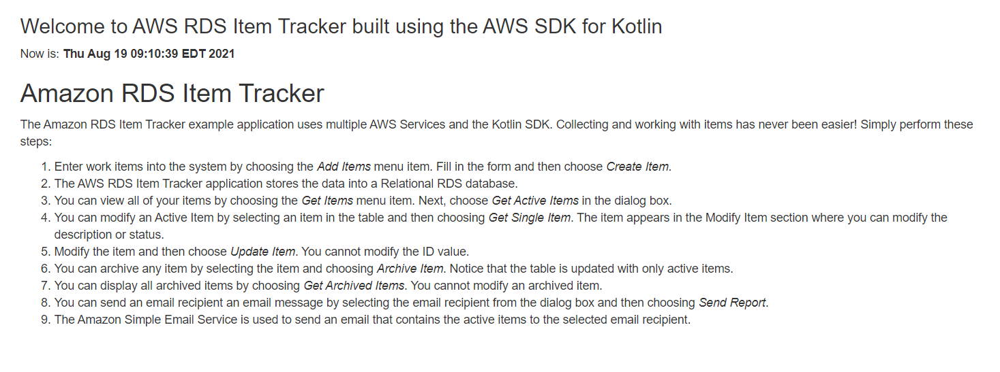
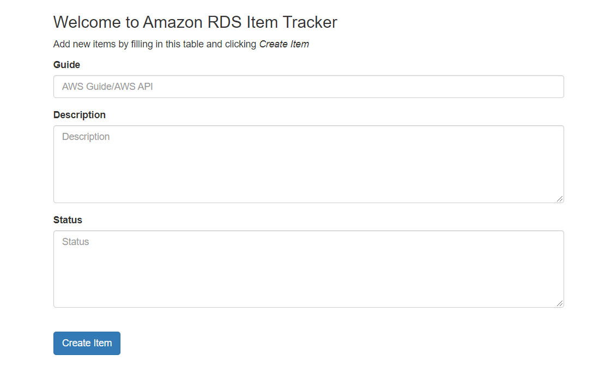
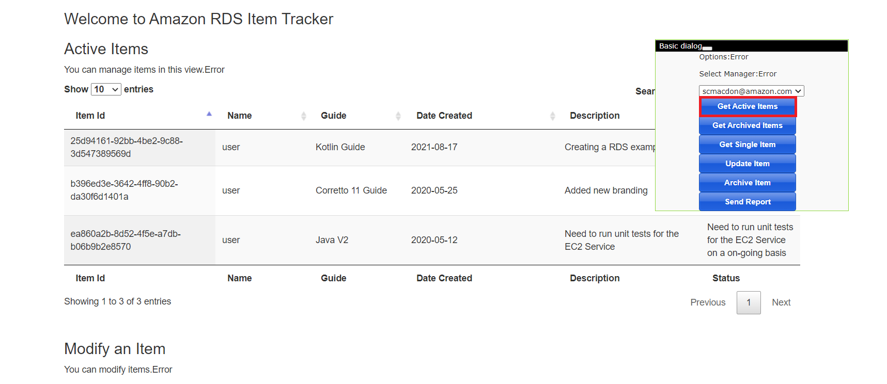
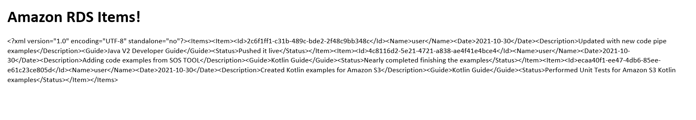
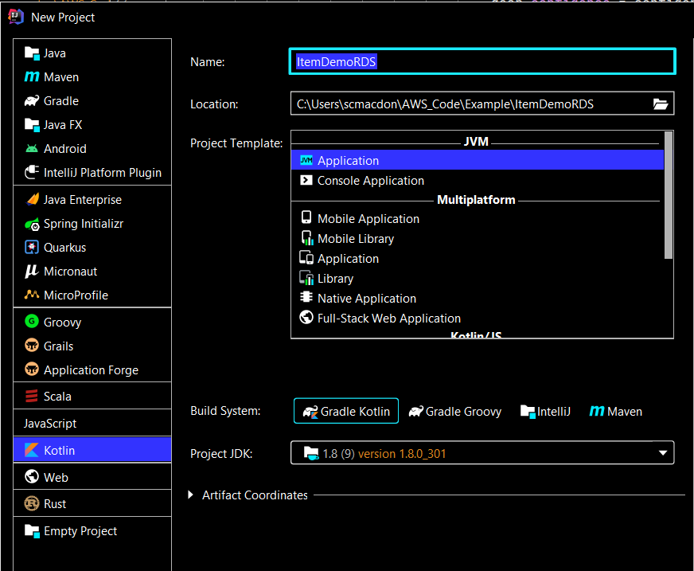
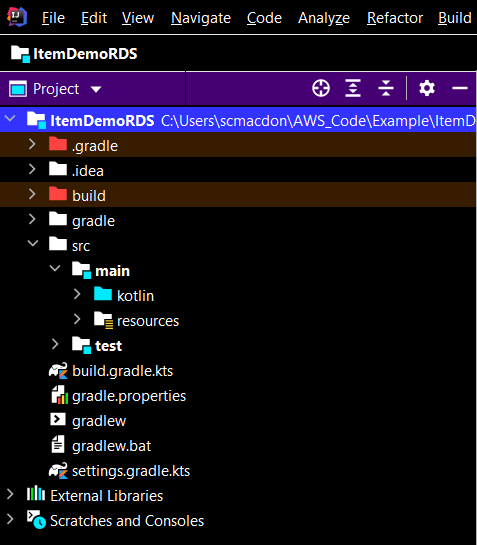
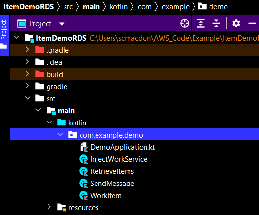
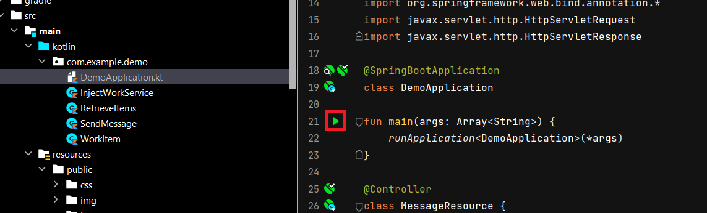

#  Creating the Serverless Amazon Aurora item tracker application using the Kotlin RdsDataClient API

## Purpose

You can develop a dynamic web application that tracks and reports on work items by using the following AWS services:

+ Amazon Serverless Amazon Aurora database
+ Amazon Simple Email Service (the AWS SDK for Kotlin is used to access Amazon SES)

The application you create is named *AWS Tracker*, and uses Spring Boot APIs to build a model, different views, and a controller. 

This AWS tutorial uses a **RdsDataClient** object to perform CRUD operations on the Serverless Amazon Aurora database. 

**Note:** You can use the **RdsDataClient** object for an Aurora Serverless DB cluster or an Aurora PostgreSQL. For more information, see [Using the Data API for Aurora Serverless](https://docs.aws.amazon.com/AmazonRDS/latest/AuroraUserGuide/data-api.html).  

**Note:** All of the Kotlin code required to complete this tutorial is located in this GitHub repository (or you can copy the code from this tutorial).  

#### Topics

+ Prerequisites
+ Understand the item tracker application
+ Create an IntelliJ project named ItemsDemo
+ Add the dependencies to your Gradle build file
+ Create the Kotlin code
+ Create the HTML files
+ Create script files
+ Run the application

## Prerequisites

To complete the tutorial, you need the following:

+ An AWS account
+ A Kotlin IDE (this tutorial uses the IntelliJ IDE)
+ Java 1.8 JDK
+ Gradle 6.8 or higher
+ Setup your development environment. For more information, see [Setting up the AWS SDK for Kotlin](https://docs.aws.amazon.com/sdk-for-kotlin/latest/developer-guide/setup.html)


**Note**: Make sure that you have installed the Kotlin plug-in for IntelliJ. 

### ⚠️ Important

+ The AWS services included in this document are included in the [AWS Free Tier](https://aws.amazon.com/free/?all-free-tier.sort-by=item.additionalFields.SortRank&all-free-tier.sort-order=asc).
+  This code has not been tested in all AWS Regions. Some AWS services are available only in specific regions. For more information, see [AWS Regional Services](https://aws.amazon.com/about-aws/global-infrastructure/regional-product-services). 
+ Running this code might result in charges to your AWS account. 
+ Be sure to terminate all of the resources you create while going through this tutorial to ensure that you’re not charged.

### Creating the resources

Create an Amazon Serverless Amazon Aurora database named **jobs**. For information, see [Creating an Aurora Serverless v1 DB cluster](https://docs.aws.amazon.com/AmazonRDS/latest/AuroraUserGuide/aurora-serverless.create.html).

To successfully connect to the database using the **RdsDataClient** object, you must setup an AWS Secrets Manager secret that is used for authentication. For information, see [Rotate Amazon RDS database credentials automatically with AWS Secrets Manager](https://aws.amazon.com/blogs/security/rotate-amazon-rds-database-credentials-automatically-with-aws-secrets-manager/). 

To use the **RdsDataClient** object, you require these two ARN values: 

+ An ARN of the Amazon Serverless Amazon Aurora database.
+ An ARN of the AWS Secrets Manager secret that is used to access the database.

**Note:** After you create the RDS MySQL database, set up inbound rules for the security group to connect to the database. You can set up an inbound rule for your development environment. Setting up an inbound rule essentially means enabling an IP address to use the database. Once you set up the inbound rules, you can connect to the database from a client such as MySQL Workbench and your local web application. For information about setting up security group inbound rules, see [Controlling Access with Security Groups](https://docs.aws.amazon.com/AmazonRDS/latest/UserGuide/Overview.RDSSecurityGroups.html).  

#### Work table
In the **jobs** database, create a table named **Work** that contains the following fields:

+ **idwork** - A VARCHAR(45) value that represents the PK.
+ **date** - A date value that specifies the date the item was created.
+ **description** - A VARCHAR(400) value that describes the item.
+ **guide** - A VARCHAR(45) value that represents the deliverable being worked on.
+ **status** - A VARCHAR(400) value that describes the status.
+ **username** - A VARCHAR(45) value that represents the user who entered the item.
+ **archive** - A TINYINT(4) value that represents whether this is an active or archive item.

The following figure shows the **Work** table in the Amazon RDS Management console.


## Understand the RDS Item Tracker application

The **RDS Item Tracker** application uses a model that is based on a work item and contains these attributes:

+ **idwork** - A VARCHAR(45) value that represents the PK.
+ **date** - A date value that specifies the date the item was created.
+ **description** - A VARCHAR(400) value that describes the item.
+ **guide** - A VARCHAR(45) value that represents the deliverable being worked on.
+ **status** - A VARCHAR(400) value that describes the status.
+ **username** - A VARCHAR(45) value that represents the user who entered the item.
+ **archive** - A TINYINT(4) value that represents whether this is an active or archive item.


The following illustration shows the **Home** page.



#### Application functionality
A user can perform these tasks in the **RDS Item Tracker** application:

+ Enter an item
+ View all active items
+ View archived items that are complete
+ Modify active items
+ Send a report to an email recipient

The following illustration shows the new item section.



A user can retrieve *active* or *archive* items. For example, a user can choose **Get Active Items** to get a dataset that's retrieved from the RDS **Work** table and displayed in the web application.



The user can select the email recipient from the **Select Manager** list and choose **Send Report**. Items are queried from the **Work** table and then the application uses Amazon SES to email the items to the selected email recipient. The following figure is an example of a report.



#### Work table
The Amazon RDS table is named **Work** and contains the following fields:

+ **idwork** - A VARCHAR(45) value that represents the PK.
+ **date** - A date value that specifies the date the item was created.
+ **description** - A VARCHAR(400) value that describes the item.
+ **guide** - A VARCHAR(45) value that represents the deliverable being worked on.
+ **status** - A VARCHAR(400) value that describes the status.
+ **username** - A VARCHAR(45) value that represents the user who entered the item.
+ **archive** - A TINYINT(4) value that represents whether this is an active or archive item.

The following figure shows the **Work** table.


## Create an IntelliJ project named ItemDemoRDS

The following figure shows the project options.



Perform these steps. 

1. In the IntelliJ IDE, choose **File**, **New**, **Project**.
2. In the **New Project** dialog box, choose **Kotlin**.
3. Enter the name **ItemDemoRDS**. 
4. Select **Gradle Kotlin** for the Build System.
5. Select your JVM option and choose **Next**.
6. Choose **Finish**.

## Add the dependencies to your Gradle build file

At this point, you have a new project named **ItemDemoRDS**.



Ensure that the **build.gradle.kts** file looks like the following.

 ```yaml   
    import org.jetbrains.kotlin.gradle.tasks.KotlinCompile

    plugins {
     id("org.springframework.boot") version "2.5.2"
     id("io.spring.dependency-management") version "1.0.11.RELEASE"
     kotlin("jvm") version "1.5.20"
     kotlin("plugin.spring") version "1.5.20"
     }

    group = "com.example"
    version = "0.0.1-SNAPSHOT"
    java.sourceCompatibility = JavaVersion.VERSION_1_8

    repositories {
     mavenCentral()
     mavenLocal()
    }

    dependencies {
     implementation("aws.sdk.kotlin:rdsdata:0.9.4-beta")
     implementation("aws.sdk.kotlin:ses:0.9.4-beta")
     implementation("org.springframework.boot:spring-boot-starter-thymeleaf")
     implementation("org.springframework.boot:spring-boot-starter-web")
     implementation("com.fasterxml.jackson.module:jackson-module-kotlin")
     implementation("org.jetbrains.kotlin:kotlin-reflect")
     implementation("org.jetbrains.kotlin:kotlin-stdlib-jdk8")
     implementation ("javax.mail:javax.mail-api:1.5.5")
     implementation ("com.sun.mail:javax.mail:1.5.5")
     implementation("mysql:mysql-connector-java:6.0.4")
     implementation("org.jetbrains.kotlinx:kotlinx-coroutines-core:1.5.0")
     testImplementation("org.springframework.boot:spring-boot-starter-test")
    }

    tasks.withType<KotlinCompile> {
     kotlinOptions {
        freeCompilerArgs = listOf("-Xjsr305=strict")
        jvmTarget = "1.8"
      }
     }

    tasks.withType<Test> {
     useJUnitPlatform()
    }
 ```

## Create the Kotlin classes

Create a new package in the **main/kotlin** folder named **com.example.demo**. The following Kotlin classes go into this package.



+ **DemoApplication** - Used as the base class and Controller for the Spring Boot application. 
+ **InjectWorkService** - Uses the RDSDataClient to submit a new record into the work table.
+ **RetrieveItems** -  Uses the RDSDataClient to retrieve a data set from the work table.
+ **SendMessage** - Uses the Amazon SES Kotlin API to send email messages.
+ **WorkItem** - Represents the application model.

**Note:** The **MessageResource** class is located in the **DemoApplication** file.

### Create the DemoApplication class

The following Kotlin code represents the **DemoApplication** and the **MessageResource** classes. Notice that the **DemoApplication** uses the **@SpringBootApplication** annotation while the **MessageResource** class uses the **@Controller** annotation. In addition, the Spring Controller uses **runBlocking** and **@runBlocking**. Both are required and part of Kotlin Coroutine functionality. For more information, see [Coroutines basics](https://kotlinlang.org/docs/coroutines-basics.html).  

 ```kotlin
    package com.example.demo

    import kotlinx.coroutines.runBlocking 
    import org.springframework.beans.factory.annotation.Autowired
    import org.springframework.boot.autoconfigure.SpringBootApplication
    import org.springframework.boot.runApplication
    import org.springframework.stereotype.Controller
    import org.springframework.web.bind.annotation.*
    import javax.servlet.http.HttpServletRequest
    import javax.servlet.http.HttpServletResponse

    @SpringBootApplication
    class DemoApplication

   fun main(args: Array<String>) {
     runApplication<DemoApplication>(*args)
   }

   @Controller
   class MessageResource {

    @Autowired
    lateinit var injectItems: InjectWorkService

    @Autowired
    lateinit var sendMsg: SendMessage

    @Autowired
    lateinit var ri: RetrieveItems

    @GetMapping("/")
    fun root(): String? {
        return "index"
    }

    @GetMapping("/add")
    fun designer(): String? {
        return "add"
    }

    @GetMapping("/items")
    fun items(): String? {
        return "items"
    }

    // Retrieve all items for a given user.
    @RequestMapping(value = ["/retrieve"], method = [RequestMethod.POST])
    @ResponseBody
    fun retrieveItems(request: HttpServletRequest, response: HttpServletResponse?): String?  = runBlocking {

        val type = request.getParameter("type")
        val name = "user"

        // Pass back all data from the database.
        val xml: String?

        return@runBlocking if (type == "active") {
            xml = ri.getItemsDataSQL(name, 0)
            xml
        } else {
            xml = ri.getItemsDataSQL(name, 1)
            xml
        }
    }

    // Add a new item to the database.
    @RequestMapping(value = ["/additems"], method = [RequestMethod.POST])
    @ResponseBody
    fun addItems(request: HttpServletRequest, response: HttpServletResponse?): String? = runBlocking{

        val nameVal = "user"
        val guideVal = request.getParameter("guide")
        val descriptionVal = request.getParameter("description")
        val statusVal = request.getParameter("status")

        // Create a Work Item object.
        val myWork = WorkItem()
        myWork.guide = guideVal
        myWork.description = descriptionVal
        myWork.status = statusVal
        myWork.name = nameVal
        val id =  injectItems.injestNewSubmission(myWork)
        return@runBlocking "Item $id added successfully!"
    }

    // Return a work item to modify.
    @RequestMapping(value = ["/modify"], method = [RequestMethod.POST])
    @ResponseBody
    fun modifyWork(request: HttpServletRequest, response: HttpServletResponse?): String? = runBlocking {
        val id = request.getParameter("id")
        return@runBlocking ri.getItemSQL(id)
    }

    // Modify the value of a work item.
    @RequestMapping(value = ["/modstatus"], method = [RequestMethod.POST])
    @ResponseBody
    fun changeWorkItem(request: HttpServletRequest, response: HttpServletResponse?): String? = runBlocking {
        val id = request.getParameter("id")
        val status = request.getParameter("stat")
        injectItems.modifySubmission(id, status)
        return@runBlocking id
    }

    // Archive a work item.
    @RequestMapping(value = ["/archive"], method = [RequestMethod.POST])
    @ResponseBody
    fun archieveWorkItem(request: HttpServletRequest, response: HttpServletResponse?): String? = runBlocking{
        val id = request.getParameter("id")
        ri.flipItemArchive(id)
        return@runBlocking id
    }

     // Email a report.
     @RequestMapping(value = ["/report"], method = [RequestMethod.POST])
     @ResponseBody
     fun getReport(request: HttpServletRequest, response: HttpServletResponse?): String? = runBlocking {
         val email = request.getParameter("email")
         val xml = ri.getItemsDataSQLReport("user", 0)
         try {
             sendMsg.send(email, xml)
         } catch (e: Exception) {
             e.stackTrace
         }
         return@runBlocking "Report was sent"
     }
   }

 ```

### InjectWorkService class 

The following Kotlin code represents the **InjectWorkService** class. Notice that you need to specify ARN values for the secret manager and the Amazon Serverless Aurora database (as discussed in the *Creating the resources* section). Without both of these values, your code does not work. To use the **RDSDataClient**, you need to create an **ExecuteStatementRequest** object and specify both ARN values, the database name, and the SQL statement used to submit data to the **work** table. 


 ```kotlin
    package com.example.demo

    import org.springframework.stereotype.Component
    import java.sql.Date
    import java.sql.SQLException
    import java.text.ParseException
    import java.text.SimpleDateFormat
    import java.time.LocalDateTime
    import java.time.format.DateTimeFormatter
    import java.util.*
    import aws.sdk.kotlin.services.rdsdata.RdsDataClient
    import aws.sdk.kotlin.services.rdsdata.model.ExecuteStatementRequest

    @Component
    class InjectWorkService {

    private val secretArnVal = "<Enter the secret manager ARN>"
    private val resourceArnVal =  "<Enter the database ARN>" ;
    
    // Return a RdsDataClient object.
    private fun getClient(): RdsDataClient {

        val rdsDataClient = RdsDataClient{region ="us-east-1"}
        return rdsDataClient
     }

     // Modify an existing record.
     suspend fun modifySubmission(id: String, status: String?): String? {
        val dataClient = getClient()
        try {
            val sqlStatement = "update work set status = '$status' where idwork = '$id'"
            val sqlRequest = ExecuteStatementRequest {
                secretArn = secretArnVal
                sql = sqlStatement
                database = "jobs"
                resourceArn = resourceArnVal
            }
            dataClient.executeStatement(sqlRequest)
            return id

        } catch (e: SQLException) {
            e.printStackTrace()
        }
        return null
     }

     // Inject a new submission.
     suspend fun injestNewSubmission(item: WorkItem): String? {
        val arc = 0
        val dataClient = getClient()
        try {

            val name = item.name
            val guide = item.guide
            val description = item.description
            val status = item.status

            // Generate the work item ID.
            val uuid = UUID.randomUUID()
            val workId = uuid.toString()

            // Date conversion.
            val dtf = DateTimeFormatter.ofPattern("yyyy/MM/dd HH:mm:ss")
            val now = LocalDateTime.now()
            val sDate1 = dtf.format(now)
            val date1 = SimpleDateFormat("yyyy/MM/dd").parse(sDate1)
            val sqlDate = Date(date1.time)

            // Inject an item into the system.
            val sqlStatement = "INSERT INTO work (idwork, username,date,description, guide, status, archive) VALUES('$workId', '$name', '$sqlDate','$description','$guide','$status','$arc');"
            val sqlRequest = ExecuteStatementRequest {
                secretArn = secretArnVal
                sql = sqlStatement
                database = "jobs"
                resourceArn = resourceArnVal
            }
            dataClient.executeStatement(sqlRequest)
            return workId
         } catch (e: SQLException) {
            e.printStackTrace()
         } catch (e: ParseException) {
            e.printStackTrace()
         }
        return null
       }
      }
 ```

### RetrieveItems class

The following Kotlin code represents the **RetrieveItems** class that retrieves data from the **Work** table. Like the **InjectWorkService** class, you must specify ARN values for the secret manager and the Amazon Serverless Aurora database.

```kotlin
    package com.example.demo

    import aws.sdk.kotlin.services.rdsdata.RdsDataClient
    import aws.sdk.kotlin.services.rdsdata.model.ExecuteStatementRequest
    import aws.sdk.kotlin.services.rdsdata.model.Field
    import org.springframework.stereotype.Component
    import org.w3c.dom.Document
    import java.io.StringWriter
    import java.sql.SQLException
    import javax.xml.parsers.DocumentBuilderFactory
    import javax.xml.parsers.ParserConfigurationException
    import javax.xml.transform.TransformerException
    import javax.xml.transform.TransformerFactory
    import javax.xml.transform.dom.DOMSource
    import javax.xml.transform.stream.StreamResult

    @Component
   class RetrieveItems {

    private val secretArnVal = "<Enter the secret manager ARN>"
    private val resourceArnVal =  "<Enter the database ARN>" ;

    // Return a RdsDataClient object.
    private fun getClient(): RdsDataClient {

        val rdsDataClient = RdsDataClient{region ="us-east-1"}
        return rdsDataClient
    }

    // Retrieve an item based on the ID.
    suspend fun flipItemArchive(id: String): String? {
        val dataClient = getClient()
        val sqlStatement: String
        val arc = 1
        try {
            // Specify the SQL Statement to query data.
            sqlStatement = "update work set archive = '$arc' where idwork ='$id' "
            val sqlRequest = ExecuteStatementRequest {
                secretArn = secretArnVal
                sql = sqlStatement
                database ="jobs"
                resourceArn = resourceArnVal
            }
            dataClient.executeStatement(sqlRequest)
        } catch (e: SQLException) {
            e.printStackTrace()
        }
        return null
    }

    // Get Items Data.
    suspend fun getItemsDataSQL(username: String, arch:Int ): String? {

        val dataClient = getClient()
        val records = mutableListOf<WorkItem>()
        val sqlStatement: String
       
        try {
            sqlStatement = "Select * FROM work where username = '$username ' and archive = $arch";
            val sqlRequest = ExecuteStatementRequest {
                secretArn = secretArnVal
                sql = sqlStatement
                database ="jobs"
                resourceArn = resourceArnVal
            }

            val response = dataClient.executeStatement(sqlRequest)
            val dataList: List<List<Field>>? = response.records
            var workItem: WorkItem
            var index: Int

            // Get the records.
            if (dataList != null) {
                for (list in dataList) {

                    workItem = WorkItem()
                    index = 0
                    for (myField in list) {
                        val field: Field = myField
                        val result = field.toString()
                        val value = result.substringAfter("=").substringBefore(')')

                        if (index == 0)
                            workItem.id = value
                        else if (index == 1)
                            workItem.date = value
                        else if (index == 2)
                            workItem.description = value
                        else if (index == 3)
                            workItem.guide = value
                        else if (index == 4)
                            workItem.status = value
                        else if (index == 5)
                            workItem.name = value

                        index++
                    }

                    // Push the object to the list.
                   records.add(workItem)
                }
            }
            return convertToString(toXml(records))
        } catch (e: SQLException) {
            e.printStackTrace()
        }
        return null
    }

    // Retrieve an item based on the ID.
    suspend fun getItemSQL(id: String): String? {
        val dataClient = getClient()
        val sqlStatement: String
        var status = ""
        var description = ""
        try {
            sqlStatement = "Select description, status FROM work where idwork ='$id' "
            val sqlRequest = ExecuteStatementRequest {
                secretArn = secretArnVal
                sql = sqlStatement
                database ="jobs"
                resourceArn = resourceArnVal
            }

            val response = dataClient.executeStatement(sqlRequest)
            val dataList: List<List<Field>>? = response.records

            // Get the records.
            if (dataList != null) {
                for (list in dataList) {

                  var  index = 0
                    for (myField in list) {
                        val field: Field = myField
                        val result = field.toString()
                        val value = result.substringAfter("=").substringBefore(')')

                        if (index == 0)
                            description = value
                        else
                            status = value
       
                        index++
                    }
                }
            }
            return convertToString(toXmlItem(id, description, status))
        } catch (e: SQLException) {
            e.printStackTrace()
        }
        return null
    }

    // Get Items data.
    suspend fun getItemsDataSQLReport(username: String, arch:Int): String? {
        val dataClient = getClient()
        val records = mutableListOf<WorkItem>()
        val sqlStatement: String
        var item: WorkItem? = null
        
        try {
            sqlStatement = "Select * FROM work where username = '" +username +"' and archive = " + arch +"";
            val sqlRequest = ExecuteStatementRequest {
                secretArn = secretArnVal
                sql = sqlStatement
                database ="jobs"
                resourceArn = resourceArnVal
            }

            val response = dataClient.executeStatement(sqlRequest)
            val dataList: List<List<Field>>? = response.records
            var workItem: WorkItem
            var index: Int

            // Get the records.
            if (dataList != null) {
                for (list in dataList) {

                    workItem = WorkItem()
                    index = 0
                    for (myField in list) {
                        val field: Field = myField
                        val result = field.toString()
                        val value = result.substringAfter("=").substringBefore(')')

                        if (index == 0)
                            workItem.id = value
                        else if (index == 1)
                            workItem.date = value
                        else if (index == 2)
                            workItem.description = value
                        else if (index == 3)
                            workItem.guide = value
                        else if (index == 4)
                            workItem.status = value
                        else if (index == 5)
                            workItem.name = value

                        index++
                    }

                    records.add(workItem)
                }
            }
            return convertToString(toXml(records))
        } catch (e: SQLException) {
            e.printStackTrace()
        }
        return null
    }

    // Convert Work data into XML to pass back to the view.
    private fun toXml(itemList: List<WorkItem>): Document? {
        try {
            val factory = DocumentBuilderFactory.newInstance()
            val builder = factory.newDocumentBuilder()
            val doc = builder.newDocument()
            val root = doc.createElement("Items")
            doc.appendChild(root)

            // Get the elements from the collection.
            val custCount = itemList.size

            // Iterate through the collection.
            for (index in 0 until custCount) {

                // Get the WorkItem object from the collection.
                val myItem = itemList[index]
                val item = doc.createElement("Item")
                root.appendChild(item)

                // Set Id.
                val id = doc.createElement("Id")
                id.appendChild(doc.createTextNode(myItem.id))
                item.appendChild(id)

                // Set Name.
                val name = doc.createElement("Name")
                name.appendChild(doc.createTextNode(myItem.name))
                item.appendChild(name)

                // Set Date.
                val date = doc.createElement("Date")
                date.appendChild(doc.createTextNode(myItem.date))
                item.appendChild(date)

                // Set Description.
                val desc = doc.createElement("Description")
                desc.appendChild(doc.createTextNode(myItem.description))
                item.appendChild(desc)

                // Set Guide.
                val guide = doc.createElement("Guide")
                guide.appendChild(doc.createTextNode(myItem.guide))
                item.appendChild(guide)

                // Set Status.
                val status = doc.createElement("Status")
                status.appendChild(doc.createTextNode(myItem.status))
                item.appendChild(status)
            }
            return doc
        } catch (e: ParserConfigurationException) {
            e.printStackTrace()
        }
        return null
    }

    private fun convertToString(xml: Document?): String? {
        try {
            val transformer = TransformerFactory.newInstance().newTransformer()
            val result = StreamResult(StringWriter())
            val source = DOMSource(xml)
            transformer.transform(source, result)
            return result.writer.toString()
        } catch (ex: TransformerException) {
            ex.printStackTrace()
        }
        return null
    }

    // Convert Work data into XML to pass back to the view.
    private fun toXmlItem(id2: String, desc2: String, status2: String): Document? {
        try {
            val factory = DocumentBuilderFactory.newInstance()
            val builder = factory.newDocumentBuilder()
            val doc = builder.newDocument()

            // Start building the XML.
            val root = doc.createElement("Items")
            doc.appendChild(root)
            val item = doc.createElement("Item")
            root.appendChild(item)

            // Set Id.
            val id = doc.createElement("Id")
            id.appendChild(doc.createTextNode(id2))
            item.appendChild(id)

            // Set Description.
            val desc = doc.createElement("Description")
            desc.appendChild(doc.createTextNode(desc2))
            item.appendChild(desc)

            // Set Status.
            val status = doc.createElement("Status")
            status.appendChild(doc.createTextNode(status2))
            item.appendChild(status)
            return doc
        } catch (e: ParserConfigurationException) {
            e.printStackTrace()
        }
        return null
    }
   }

 ```

### Create the SendMessage class

The **SendMessage** class uses the AWS SDK for Kotlin SES API to send an email message that contains the data queried from the **Work** table. An email address that you send an email message to must be verified. For information, see [Verifying an email address](https://docs.aws.amazon.com/ses/latest/DeveloperGuide//verify-email-addresses-procedure.html).

 ```kotlin
    package com.example.demo

   import org.springframework.stereotype.Component
   import kotlin.system.exitProcess
   import aws.sdk.kotlin.services.ses.SesClient
   import aws.sdk.kotlin.services.ses.model.SesException
   import aws.sdk.kotlin.services.ses.model.Destination
   import aws.sdk.kotlin.services.ses.model.Content
   import aws.sdk.kotlin.services.ses.model.Body
   import aws.sdk.kotlin.services.ses.model.Message
   import aws.sdk.kotlin.services.ses.model.SendEmailRequest

   @Component
   class SendMessage {

    suspend fun send(
        recipient: String,
        strValue: String?
    ) {
        val sesClient = SesClient { region = "us-east-1" }
        // The HTML body of the email.
        val bodyHTML = ("<html>" + "<head></head>" + "<body>" + "<h1>Amazon RDS Items!</h1>"
                + "<textarea>$strValue</textarea>" + "</body>" + "</html>")

        val destinationOb = Destination {
            toAddresses = listOf(recipient)
        }

        val contentOb = Content {
            data = bodyHTML
        }

        val subOb = Content {
            data = "Item Report"
        }

        val bodyOb= Body {
            html = contentOb
        }

        val msgOb = Message {
            subject = subOb
            body = bodyOb
        }

        val emailRequest = SendEmailRequest {
            destination = destinationOb
            message = msgOb
            source = "scmacdon@amazon.com"
        }

        try {
            println("Attempting to send an email through Amazon SES using the AWS SDK for Kotlin...")
            sesClient.sendEmail(emailRequest)

        } catch (e: SesException) {
            println(e.message)
            sesClient.close()
            exitProcess(0)
        }
    }
  }
 ```

### Create the WorkItem class

The following Java code represents the **WorkItem** class.

 ```kotlin
    package com.example.demo

    class WorkItem {

     var id: String? = null
     var arc: String? = null
     var name: String? = null
     var guide: String? = null
     var date: String? = null
     var description: String? = null
     var status: String? = null
    }
 ```

## Create the HTML files

At this point, you have created all of the Kotlin files required for the **Item Tracker** application. Now you create the HTML files that are required for the application's graphical user interface (GUI). Under the resource folder, create a **templates** folder, and then create the following HTML files:

+ **index.html**
+ **add.html**
+ **items.html**
+ **layout.html**

The **index.html** file is used as the application's home view. The **add.html** file represents the view for adding an item to the system. The **items.html** file is used to view and modify the items. Finally, the **layout.html** file represents the menu that is visible in all views.  

#### index.html

The following HTML code represents the **index.html** file. This file represents the application's home view.

 ```html
    <!DOCTYPE html>
    <html xmlns:th="http://www.thymeleaf.org" >

   <head>
     <meta charset="utf-8" />
     <meta http-equiv="X-UA-Compatible" content="IE=edge" />
     <meta name="viewport" content="width=device-width, initial-scale=1" />
     <link rel="stylesheet" th:href="|https://maxcdn.bootstrapcdn.com/bootstrap/3.3.7/css/bootstrap.min.css|"/>
     <link rel="stylesheet" href="../public/css/styles.css" th:href="@{/css/styles.css}" />
     <link rel="icon" href="../public/img/favicon.ico" th:href="@{/img/favicon.ico}" />

    <title>AWS DynamoDB Item Tracker</title>
  </head>

  <body>
  <header th:replace="layout :: site-header"/>
  <div class="container">

    <h3>Welcome to the Serverless Amazon Aurora Item Tracker built using the AWS SDK for Kotlin</h3>
    <p>Now is: <b th:text="${execInfo.now.time}"></b></p>
    <p>The Amazon RDS Item Tracker example application uses multiple AWS Services and the Kotlin SDK. Collecting and working with items has never been easier! Simply perform these steps:<p>

    <ol>
        <li>Enter work items into the system by choosing the <i>Add Items</i> menu item. Fill in the form and then choose <i>Create Item</i>.</li>
        <li>The AWS RDS Item Tracker application stores the data into a Relational RDS database.</li>
        <li>You can view all of your items by choosing the <i>Get Items</i> menu item. Next, choose <i>Get Active Items</i> in the dialog box.</li>
        <li>You can modify an Active Item by selecting an item in the table and then choosing <i>Get Single Item</i>. The item appears in the Modify Item section where you can modify the description or status.</li>
        <li>Modify the item and then choose <i>Update Item</i>. You cannot modify the ID value. </li>
        <li>You can archive any item by selecting the item and choosing <i>Archive Item</i>. Notice that the table is updated with only active items.</li>
        <li>You can display all archived items by choosing <i>Get Archived Items</i>. You cannot modify an archived item.</li>
        <li>You can send an email recipient an email message by selecting the email recipient from the dialog box and then choosing <i>Send Report</i>.</li>
        <li>The Amazon Simple Email Service is used to send an email that contains the active items to the selected email recipient.</li>
    </ol>
    <div>
   </body>
   </html>
 ```
	    
#### add.html

The following code represents the **add.html** file that enables users to add new items.

 ```html
    <html xmlns:th="http://www.thymeleaf.org">
    <head>
     <title>Add Items</title>
     <script th:src="|https://code.jquery.com/jquery-1.12.4.min.js|"></script>
     <script th:src="|https://code.jquery.com/ui/1.11.4/jquery-ui.min.js|"></script>
     <script src="../public/js/contact_me.js" th:src="@{/js/contact_me.js}"></script>

     <!-- CSS files -->
     <link rel="stylesheet" th:href="|https://maxcdn.bootstrapcdn.com/bootstrap/3.3.7/css/bootstrap.min.css|"/>
     <link rel="stylesheet" href="../public/css/styles.css" th:href="@{/css/styles.css}" />
   </head>
   <body>
    <header th:replace="layout :: site-header"/>
  <div class="container">
    <h3>Welcome to the Serverless Amazon Aurora Item Tracker built using the AWS SDK for Kotlin</h3>
    <p>Add new items by filling in this table and clicking <i>Create Item</i></p>

    <div class="row">
        <div class="col-lg-8 mx-auto">

           <div class="control-group">
                    <div class="form-group floating-label-form-group controls mb-0 pb-2">
                        <label>Guide</label>
                        <input class="form-control" id="guide" type="guide" placeholder="AWS Guide/AWS API" required="required" data-validation-required-message="Please enter the AWS Guide.">
                        <p class="help-block text-danger"></p>
                    </div>
                </div>
                <div class="control-group">
                    <div class="form-group floating-label-form-group controls mb-0 pb-2">
                        <label>Description</label>
                        <textarea class="form-control" id="description" rows="5" placeholder="Description" required="required" data-validation-required-message="Please enter a description."></textarea>
                        <p class="help-block text-danger"></p>
                    </div>
                </div>
                <div class="control-group">
                    <div class="form-group floating-label-form-group controls mb-0 pb-2">
                        <label>Status</label>
                        <textarea class="form-control" id="status" rows="5" placeholder="Status" required="required" data-validation-required-message="Please enter the status."></textarea>
                        <p class="help-block text-danger"></p>
                    </div>
                </div>
                <br>
                <button type="submit" class="btn btn-primary btn-xl" id="SendButton">Create Item</button>
           </div>
     </div>
     </div>
    </body>
    </html>
 ```
		
#### items.html

The following code represents the **items.html** file. This file enables users to modify items and send reports.

 ```html
	<!DOCTYPE html>
        <html xmlns:th="http://www.thymeleaf.org">
         <html>
         <head>
         <title>Modify Items</title>

         <script th:src="|https://code.jquery.com/jquery-1.12.4.min.js|"></script>
         <script th:src="|https://code.jquery.com/ui/1.11.4/jquery-ui.min.js|"></script>
         <script th:src="|https://cdn.datatables.net/v/dt/dt-1.10.20/datatables.min.js|"></script>
         <script th:src="|https://maxcdn.bootstrapcdn.com/bootstrap/3.4.1/js/bootstrap.min.js|"></script>
         <script src="../public/js/items.js" th:src="@{/js/items.js}"></script>

         <!-- CSS files  -->
         <link rel="stylesheet" th:href="|https://maxcdn.bootstrapcdn.com/bootstrap/3.3.7/css/bootstrap.min.css|"/>
         <link rel="stylesheet" th:href="|https://cdn.datatables.net/v/dt/dt-1.10.20/datatables.min.css|"/>
         <link rel="stylesheet" href="../public/css/styles.css" th:href="@{/css/styles.css}" />
         <link rel="stylesheet" href="../public/css/col.css" th:href="@{/css/col.css}" />
         <link rel="stylesheet" href="../public/css/button.css" th:href="@{/css/button.css}" />
         <link rel="stylesheet" href="../public/css/all.min.css" th:href="@{/css/all.min.css}" />

      </head>
      <body>
     <header th:replace="layout :: site-header"/>

    <div class="container">

    <h3>Welcome to the Serverless Amazon Aurora Item Tracker built using the AWS SDK for Kotlin</h3>
    <h4 id="info3">Get Items</h4>
    <p>You can manage items in this view.</p>
    <table id="myTable" class="display" style="width:100%">
        <thead>
        <tr>
            <th>Item Id</th>
            <th>Name</th>
            <th>Guide</th>
            <th>Date Created</th>
            <th>Description</th>
            <th>Status</th>
        </tr>
        </thead>
        <tbody>
        <tr>
            <td>No Data</td>
            <td>No Data</td>
            <td>No Data </td>
            <td>No Data</td>
            <td>No Data</td>
            <td>No Data</td>
        </tr>
        </tbody>
        <tfoot>
        <tr>
            <th>Item Id</th>
            <th>Name</th>
            <th>Guide</th>
            <th>Date Created</th>
            <th>Description</th>
            <th>Status</th>
        </tr>
        </tfoot>
        <div id="success3"></div>
    </table>

    </div>
    <br>
    <div id="modform" class="container" >

    <h3>Modify an Item</h3>
    <p>You can modify items.</p>

    <form>
        <div class="control-group">
            <div class="form-group floating-label-form-group controls mb-0 pb-2">
                <label>ID</label>
                <input class="form-control" id="id" type="id" placeholder="Id" readonly data-validation-required-message="Item Id.">
                <p class="help-block text-danger"></p>
            </div>
        </div>
        <div class="control-group">
            <div class="form-group floating-label-form-group controls mb-0 pb-2">
                <label>Description</label>
                <textarea class="form-control" id="description" rows="5" placeholder="Description" readonly data-validation-required-message="Description."></textarea>
                <p class="help-block text-danger"></p>
            </div>
        </div>
        <div class="control-group">
            <div class="form-group floating-label-form-group controls mb-0 pb-2">
                <label>Status</label>
                <textarea class="form-control" id="status" rows="5" placeholder="Status" required="required" data-validation-required-message="Status"></textarea>
                <p class="help-block text-danger"></p>
            </div>
        </div>
        <br>
     </form>

    </div>

    <div id="dialogtemplate2" border="2" title="Basic dialog">

     <table  align="center">
        <tr>
            <td>
                <p>Options:</p>
            </td>
            <td>

            </td>
        </tr>
        <tr>
            <td>
                <p>Select Manager:</p>
            </td>
            <td>

            </td>
        </tr>
        <tr>
            <td>
                <select id="manager">
                    <option value="scmacdon@amazon.com">scmacdon@amazon.com</option>
                </select>
            </td>
            <td>

            </td>
        </tr>

        <tr>

        <tr>
            <td>
                <button class="shiny-blue" type="button" onclick="GetItems()">Get Active Items</button>
            </td>

            <td>

            </td>
        </tr>
        <tr>
            <td>
                <button class="shiny-blue" type="button" onclick="GetArcItems()">Get Archived Items</button>
            </td>

            <td>

            </td>
        </tr>
        <tr>
            <td>
                <button class="shiny-blue" id="singlebutton" type="button" onclick="ModifyItem()">Get Single Item</button>
            </td>

            <td>

            </td>
        </tr>
        <tr>
            <td>
                <button class="shiny-blue" id="updatebutton" type="button" onclick="modItem()">Update Item</button>
            </td>

            <td>

            </td>
        </tr>
        <tr>
            <td>
                <button class="shiny-blue"  id="archive" type="button" onclick="archiveItem()">Archive Item</button>
            </td>

            <td>

            </td>
        </tr>
        <tr>
            <td>
                <button class="shiny-blue" type="button" id="reportbutton" onclick="Report()">Send Report</button>
            </td>

            <td>

            </td>
        </tr>
     </table>
    </div>
    <style>

    .ui-widget {
        font-family: Verdana,Arial,sans-serif;
        font-size: .8em;
    }

    .ui-widget-content {
        background: #F9F9F9;
        border: 1px solid #90d93f;
        color: #222222;
    }

    .ui-dialog {
        left: 0;
        outline: 0 none;
        padding: 0 !important;
        position: absolute;
        top: 0;
    }

    #success {
        padding: 0;
        margin: 0;
    }

    .ui-dialog .ui-dialog-content {
        background: none repeat scroll 0 0 transparent;
        border: 0 none;
        overflow: auto;
        position: relative;
        padding: 0 !important;
    }

    .ui-widget-header {
        background: #000;
        border: 0;
        color: #fff;
        font-weight: normal;
    }

    .ui-dialog .ui-dialog-titlebar {
        padding: 0.1em .5em;
        position: relative;
        font-size: 1em;
    }

    </style>
    </body>
    </html>
  ```
		
 **Note:** Replace the default email addresses with real email addresses in this file.

#### layout.html

The following code represents the **layout.html** file that represents the application's menu.

 ```html
	<!DOCTYPE html>
       <html xmlns:th="http://www.thymeleaf.org">
       <head th:fragment="site-head">
        <meta charset="UTF-8" />
        <link rel="icon" href="../public/img/favicon.ico" th:href="@{/img/favicon.ico}" />
        <script th:src="|https://code.jquery.com/jquery-1.12.4.min.js|"></script>
        <meta th:include="this :: head" th:remove="tag"/>
      </head>
      <body>
      <!-- th:hef calls a controller method - which returns the view -->
     <header th:fragment="site-header">
     <a href="index.html" th:href="@{/}"></a>
     <a href="#" style="color: white" th:href="@{/}">Home</a>
     <a href="#" style="color: white" th:href="@{/add}">Add Items</a>
     <a href="#"  style="color: white" th:href="@{/items}">Get Items</a>

    </header>
    <h1>Welcome</h1>
    <body>
    <p>Welcome to Amazon DynamoDB Item Tracker.</p>
    </body>
    </html>
 ```

## Create script files

Both the **add** and **items** views use script files to communicate with the Spring controllers. You have to ensure that these files are part of your project; otherwise, your application doesn’t work.

+ **items.js**
+ **contact_me.js**

Both files contain application logic that sends a request to the Spring Controller using AJAX. In addition, these files handle the response and set the data in the view.

#### items.js file

The following JavaScript code represents the **items.js** file that is used in the **items.html** view.

 ```javascript	
	$(function() {

         $( "#dialogtemplate2" ).dialog();

         $('#myTable').DataTable( {
          scrollY:        "500px",
          scrollX:        true,
          scrollCollapse: true,
          paging:         true,
          columnDefs: [
            { width: 200, targets: 0 }
          ],
         fixedColumns: true
        } );

        var table = $('#myTable').DataTable();
        $('#myTable tbody').on( 'click', 'tr', function () {
        if ( $(this).hasClass('selected') ) {
            $(this).removeClass('selected');
        } else {
            table.$('tr.selected').removeClass('selected');
            $(this).addClass('selected');
        }
       } );

      // Disable the report button
      $('#reportbutton').prop("disabled",true);
      $('#reportbutton').css("color", "#0d010d");

     });


      function modItem() {
        var id = $('#id').val();
        var stat = $('#status').val();

        if (id == "") {
            alert("Please select an item from the table");
            return;
        }

        if (stat.length > 350) {
            alert("Status has too many characters");
            return;
        }

     $.ajax('/modstatus', {
        type: 'POST',  // http method
        data: 'stat=' + stat + '&id=' + id ,
        success: function (data, status, xhr) {

            alert("You have successfully modfied item "+data)
            $('#id').val("");
            $('#description').val("");
            $('#status').val("");

            //Refresh the grid
            GetItems();
        },
        error: function (jqXhr, textStatus, errorMessage) {
            $('p').append('Error' + errorMessage);
        }
     });
    }

     // Populate the table with work items
     function GetItems() {

     var type="active";
     $.ajax('/retrieve', {
        type: 'POST',  // http method
        data: 'type=' + type ,  // data to submit
        success: function (data, status, xhr) {
            //$('p').append('status: ' + status + ', data: ' + data);
            var xml = data

             // Enable the buttons
            $('#singlebutton').prop("disabled",false);
            $('#updatebutton').prop("disabled",false);
            $('#reportbutton').prop("disabled",false);
            $('#reportbutton').css("color", "#FFFFFF");
            $('#singlebutton').css("color", "#FFFFFF");
            $('#updatebutton').css("color", "#FFFFFF");
            $('#archive').prop("disabled",false);
            $('#archive').css("color", "#FFFFFF");

            $("#modform").show();
            var oTable = $('#myTable').dataTable();
            oTable.fnClearTable(true);

            $(xml).find('Item').each(function () {

                var $field = $(this);
                var id = $field.find('Id').text();
                var name = $field.find('Name').text();
                var guide = $field.find('Guide').text();
                var date = $field.find('Date').text();
                var description = $field.find('Description').text();
                var status = $field.find('Status').text();

                //Set the new data
                oTable.fnAddData( [
                    id,
                    name,
                    guide,
                    date,
                    description,
                    status,,]
                );
            });

            document.getElementById("info3").innerHTML = "Active Items";

        },
        error: function (jqXhr, textStatus, errorMessage) {
            $('p').append('Error' + errorMessage);
        }
      });
     }

     function GetArcItems() {

     var type="archive";
     $.ajax('/retrieve', {
        type: 'POST',  // http method
        data: 'type=' + type ,  // data to submit
        success: function (data, status, xhr) {
            var xml = data

            // Disable buttons when Achive button
            $('#reportbutton').prop("disabled",true);
            $('#reportbutton').css("color", "#0d010d");
            $('#singlebutton').prop("disabled",true);
            $('#singlebutton').css("color", "#0d010d");
            $('#updatebutton').prop("disabled",true);
            $('#updatebutton').css("color", "#0d010d");
            $('#archive').prop("disabled",true);
            $('#archive').css("color", "#0d010d");

            $("#modform").hide();
            var oTable = $('#myTable').dataTable();
            oTable.fnClearTable(true);

            $(xml).find('Item').each(function () {

                var $field = $(this);
                var id = $field.find('Id').text();
                var name = $field.find('Name').text();
                var guide = $field.find('Guide').text();
                var date = $field.find('Date').text();
                var description = $field.find('Description').text();
                var status = $field.find('Status').text();

                //Set the new data
                oTable.fnAddData( [
                    id,
                    name,
                    guide,
                    date,
                    description,
                    status,,]
                );
            });

            document.getElementById("info3").innerHTML = "Archive Items";
        },
        error: function (jqXhr, textStatus, errorMessage) {
            $('p').append('Error' + errorMessage);
        }
       });
      }

     function ModifyItem() {
      var table = $('#myTable').DataTable();
      var myId="";
      var arr = [];
      $.each(table.rows('.selected').data(), function() {

        var value = this[0];
        myId = value;
     });

     if (myId == "") {
        alert("You need to select a row");
        return;
     }

     //Need to check its not an Archive item
     var h3Val =  document.getElementById("info3").innerHTML;
     if (h3Val=="Archive Items") {
        alert("You cannot modify an Archived item");
        return;
     }

     $.ajax('/modify', {
        type: 'POST',  // http method
        data: 'id=' + myId ,  // data to submit
        success: function (data, status, xhr) {
            var xml = data
            $(xml).find('Item').each(function () {

                var $field = $(this);
                var id = $field.find('Id').text();
                var description = $field.find('Description').text();
                var status = $field.find('Status').text();

                //Set the fields
                $('#id').val(id);
                $('#description').val(description);
                $('#status').val(status);

            });

        },
        error: function (jqXhr, textStatus, errorMessage) {
            $('p').append('Error' + errorMessage);
        }
       });
      }

      function Report() {
        var email = $('#manager option:selected').text();

        $.ajax('/report', {
            type: 'POST',  // http method
            data: 'email=' + email ,  // data to submit
            success: function (data, status, xhr) {
                var xml = data
                alert(data);

            },
            error: function (jqXhr, textStatus, errorMessage) {
                alert("Error");
            }
        });
       }

     function archiveItem() {
      var table = $('#myTable').DataTable();
      var myId="";
      var arr = [];
      $.each(table.rows('.selected').data(), function() {

        var value = this[0];
        myId = value;
     });

     if (myId == "") {
        alert("You need to select a row");
        return;
     }

    $.ajax('/archive', {
        type: 'POST',  // http method
        data: 'id=' + myId ,  // data to submit
        success: function (data, status, xhr) {
            var xml = data
           alert(xml +"is archived")
            //Refresh the grid
            GetItems();
        },
        error: function (jqXhr, textStatus, errorMessage) {
            alert("Error");

        }
      });
     }
 ```

 #### contact_me.js file

The following JavaScript code represents the **contact_me.js** file that is used in the **add.html** view.

 ```javascript	
	$(function() {
         $("#SendButton" ).click(function($e) {

         var body = $('#body').val();
         if (body == '' ){
            alert("Please enter text");
            return;
         }

         $.ajax('/addMessage', {
            type: 'POST',  // http method
            data: 'body=' + body,  // data to submit
            success: function (data, status, xhr) {

                alert(data)
                $('#body').val("");
            },
            error: function (jqXhr, textStatus, errorMessage) {
                $('p').append('Error' + errorMessage);
            }
        });

       } );// END of the Send button click
      } );

     function subEmail(){
     var mail = $('#inputEmail1').val();
     var result = validate(mail)
     if (result == false) {
        alert (mail + " is not valid. Please specify a valid email");
        return;
     }

     // Valid email, post to the server
      $.ajax('/addEmail', {
        type: 'POST',  // http method
        data: 'email=' + mail,  // data to submit
        success: function (data, status, xhr) {

            $('#inputEmail1').val("")
            alert("Subscription validation is "+data);
        },
        error: function (jqXhr, textStatus, errorMessage) {
            $('p').append('Error' + errorMessage);
        }
       });
      }

     function validateEmail(email) {
     const re = /^(([^<>()[\]\\.,;:\s@\"]+(\.[^<>()[\]\\.,;:\s@\"]+)*)|(\".+\"))@((\[[0-9]{1,3}\.[0-9]{1,3}\.[0-9]{1,3}\.[0-9]{1,3}\])|(([a-zA-Z\-0-9]+\.)+[a-zA-Z]{2,}))$/;
    return re.test(email);
    }

    function validate(email) {
     const $result = $("#result");

     if (validateEmail(email)) {
        return true ;
     } else {
        return false ;
     }
    }

    function getSubs(){

    $.ajax('/getSubs', {
        type: 'GET',  // http method
        success: function (data, status, xhr) {

            $('.modal-body').empty();
            var xml = data ;
            $(xml).find('Sub').each(function ()  {

                var $field = $(this);
                var email = $field.find('email').text();

                // Append this data to the main list.
                $('.modal-body').append("<p><b>"+email+"</b></p>");
            });
            $("#myModal").modal();
        },

        error: function (jqXhr, textStatus, errorMessage) {
            $('p').append('Error' + errorMessage);
        }
      });
     }


     function delSub(event) {
      var mail = $('#inputEmail1').val();
      var result = validate(mail)
     
     if (result == false) {
        alert (mail + " is not valid. Please specify a valid email");
        return;
     }

     $.ajax('/delSub', {
        type: 'POST',  // http method
        data: 'email=' + mail,  // data to submit
        success: function (data, status, xhr) {

            alert(data);
        },

        error: function (jqXhr, textStatus, errorMessage) {
            $('p').append('Error' + errorMessage);
        }
       });
     }
 ```

**Note:** There are other CSS files located in the GitHub repository that you must add to your project. Ensure all of the files under the **resources** folder are included in your project.

## Run the application

Using the IntelliJ IDE, you can run your application. The first time you run the Spring Boot application, you can run the application by clicking the run icon in the Spring Boot main class, as shown in this illustration. 



### Next Steps
Congratulations, you have created and deployed the DynamoDB Item Tracker application that interacts with AWS services. As stated at the beginning of this tutorial, be sure to terminate all of the resources you created while going through this tutorial to ensure that you’re no longer charged.

