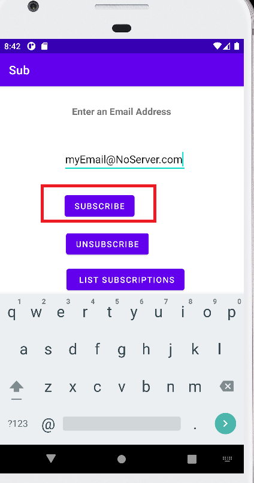
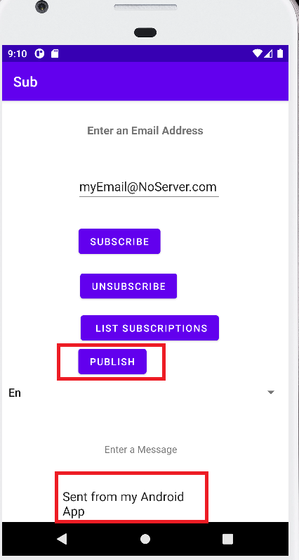
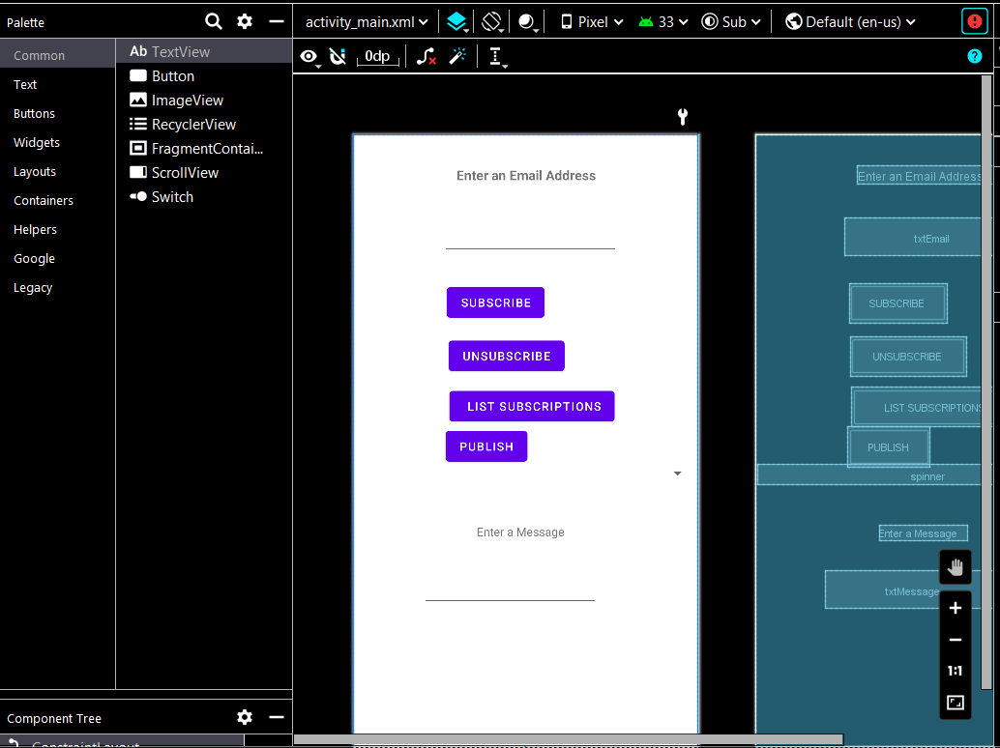

# Creating a publish/subscription Android application that translates messages using the AWS SDK for Kotlin

## Overview

| Heading      | Description |
| ----------- | ----------- |
| Description | Dicusses how to develop a native Android application with publish/subsciption functionality and the ability to translate messages by using the AWS SDK for Kotlin.     |
| Audience   |  Developer (beginner / intermediate)        |
| Updated   | 1/27/2023        |
| Required Skills   | Kotlin, Gradle  |

## Purpose

Create a native Android application with subscription and publish functionality by using Amazon Simple Notification Service (Amazon SNS) and the AWS SDK for Kotlin. The application created in this AWS tutorial is an Android application that lets a user subscribe to an Amazon SNS topic by entering a valid email address. A user can enter many emails and all of them are subscribed to the given SNS topic after the email recipients confirm the subscription. The user can publish a message that results in all subscribed emails receiving the message. If desired, the user can select another langange and the message is translated by using Amazon Translate.

In addition to the AWS SDK for Kotlin, this application also uses the Android API to build the application logic. For more information, see [Android API reference](https://developer.android.com/reference.html).

**Note**: Amazon SNS is a managed service that provides message delivery from publishers to subscribers (also known as producers and consumers). For more information, see [What is Amazon SNS?](https://docs.aws.amazon.com/sns/latest/dg/welcome.html)


#### Topics

+ Prerequisites
+ Understand the Publish/Subscription application
+ Create an Android project 
+ Add dependencies to your Android project
+ Create the layout XML file for your Android project
+ Create the Kotlin classes for your Android project
+ Run the Android application


## Prerequisites

To complete the tutorial, you need the following:

+ An AWS account.
+ An IDE that lets you build Android projects. (This example uses Android Studio Electric Eel.)
+ Java 1.8 SDK.
+ Gradle 6.8 or higher.
+ Min API version is 24.
+ Requires core library desugaring in the Gradle build file.
+ Source/target compat of 1.8.
+ Set up your development environment. For more information, see [Get started with the SDK for Kotlin](https://docs.aws.amazon.com/sdk-for-kotlin/latest/developer-guide/get-started.html).

### ⚠️ Important

+ The AWS services included in this document are included in the [AWS Free Tier](https://aws.amazon.com/free/?all-free-tier.sort-by=item.additionalFields.SortRank&all-free-tier.sort-order=asc).
+  This code has not been tested in all AWS Regions. Some AWS services are available only in specific regions. For more information, see [AWS Regional Services](https://aws.amazon.com/about-aws/global-infrastructure/regional-product-services). 
+ Running this code might result in charges to your AWS account. 
+ Be sure to delete all of the resources you create during this tutorial so that you won't be charged.

### AWS Credentials

Because the Kotlin code is running on a mobile device, you cannot use some of the AWS credential providers such as Shared credentials. This is because the mobile application can't read the credentials file from your local computer. For this reason, the **StaticCredentialsProvider** provider is used. 

    fun getStatic() : StaticCredentialsProvider{
        val staticCredentials = StaticCredentialsProvider {
            accessKeyId = "<Enter value>"
            secretAccessKey = "<Enter value>"
        }
        return staticCredentials
    }
    
However, you can also use the **Environment variables** provider. In this situation, you must set the key values in your Android Studio development environment. For more information, see [Environment variables](https://developer.android.com/studio/command-line/variables).

After you do, you can use the **EnvironmentCredentialsProvider** provider.

     fun getTranslateClient() : TranslateClient{
        val translateClient = TranslateClient{
            region = "us-west-2"
            credentialsProvider = EnvironmentCredentialsProvider()
        }
        return translateClient
    }
    
For more information, see [Credential providers](https://docs.aws.amazon.com/sdk-for-kotlin/latest/developer-guide/credential-providers.html).     


### Creating the resources

Create an Amazon SNS topic. You must reference the ARN of the Amazon SNS topic in your Kotlin code. For information, see [Creating an Amazon SNS topic](https://docs.aws.amazon.com/sns/latest/dg/sns-create-topic.html).

## Understand the Publish/Subscription application

To subscribe to an Amazon SNS topic, the user enters a valid email address into the Android application and chooses the **Subscribe** button. 



The specified email address recieves an email message that lets the recipient confirm the subscription. 


To publish a message, a user enters the message into the Android application and then chooses the **Publish** button. 



This application lets a user specify the language of the message that is sent. For example, the user can select **Fr** from the dropdown field and then the message appears in French to all subscribed users. 


**Note**: Amazon Translate is used to translate the body of the message. The code is shown later in this document. 

This example application lets you view all of the subscribed email recipients by choosing the **List Subscriptions** button, as shown in the following illustration.


## Create an Android project
1. In Android Studio, choose **File**, **New**, **Project**.
2. In the **New Project** dialog box, choose **Empty Activity**.
3. Choose **Next**.
5. In the **Name** field, enter **AndroidSubPub**.
6. In the **Package name** field, enter **com.example.sub**. 
7. From the **Language** field, choose **Kotlin**. 
8. In the **Minimum API** field, specify **API 26 - Android 8**.
9. Choose **Finish**.


## Add dependencies to your Android project

At this point, you have a new project named **AndroidSubPub** with a default Kotlin class named **MainActivity**. Notice the Gradle build file.


Add the following dependencies to the Gradle build file.

```yaml
   plugins {
    id 'com.android.application'
    id 'kotlin-android'
   }

   android {
    compileSdk 30

    defaultConfig {
        applicationId "com.example.awsapp"
        minSdk 26
        targetSdk 30
        versionCode 1
        versionName "1.0"

        testInstrumentationRunner "androidx.test.runner.AndroidJUnitRunner"
    }

    buildTypes {

        create("customDebugType") {
            debuggable = true
        }
        release {
            minifyEnabled false
            proguardFiles getDefaultProguardFile('proguard-android-optimize.txt'), 'proguard-rules.pro'
        }
       }
      compileOptions {
        sourceCompatibility JavaVersion.VERSION_1_8
        targetCompatibility JavaVersion.VERSION_1_8
      }
      kotlinOptions {
        jvmTarget = '1.8'
      } 
   }

   dependencies {

     implementation 'androidx.core:core-ktx:1.6.0'
     implementation("aws.sdk.kotlin:translate:0.19.0-beta")
    implementation("aws.sdk.kotlin:sns:0.19.0-beta")  {
        exclude group: "xmlpull", module: "xmlpull"
    }
     coreLibraryDesugaring 'com.android.tools:desugar_jdk_libs:1.1.5'
     implementation 'androidx.appcompat:appcompat:1.3.1'
     implementation 'com.google.android.material:material:1.4.0'
     implementation 'androidx.constraintlayout:constraintlayout:2.1.0'
     testImplementation 'junit:junit:4.+'
     androidTestImplementation 'androidx.test.ext:junit:1.1.3'
     androidTestImplementation 'androidx.test.espresso:espresso-core:3.4.0'
     }

```

## Create the layout XML file for your Android project

The user interface for your Android project is defined in an XML file named **activity_main.xml**, as shown in the following illustration. 



You can modify the **activity_main.xml** file with the following code. 


```yaml
   <?xml version="1.0" encoding="utf-8"?>
<androidx.constraintlayout.widget.ConstraintLayout xmlns:android="http://schemas.android.com/apk/res/android"
    xmlns:app="http://schemas.android.com/apk/res-auto"
    xmlns:tools="http://schemas.android.com/tools"
    android:layout_width="match_parent"
    android:layout_height="match_parent"
    tools:context=".MainActivity">

    <TextView
        android:layout_width="wrap_content"
        android:layout_height="wrap_content"
        android:text="Enter an email address"
        android:textSize="16sp"
        android:textStyle="bold"
        app:layout_constraintBottom_toBottomOf="parent"
        app:layout_constraintLeft_toLeftOf="parent"
        app:layout_constraintRight_toRightOf="parent"
        app:layout_constraintTop_toTopOf="parent"
        app:layout_constraintVertical_bias="0.053" />

    <EditText
        android:id="@+id/txtEmail"
        android:layout_width="wrap_content"
        android:layout_height="wrap_content"
        android:layout_marginTop="100dp"
        android:layout_marginEnd="96dp"
        android:ems="10"
        android:inputType="textEmailAddress"
        app:layout_constraintEnd_toEndOf="parent"
        app:layout_constraintTop_toTopOf="parent" />

    <Button
        android:id="@+id/btnSub"
        android:layout_width="wrap_content"
        android:layout_height="wrap_content"
        android:layout_marginTop="32dp"
        android:layout_marginEnd="184dp"
        android:onClick="subUser"
        android:text="Subscribe"
        app:layout_constraintEnd_toEndOf="parent"
        app:layout_constraintTop_toBottomOf="@+id/txtEmail" />

    <Button
        android:id="@+id/btnUnSub"
        android:layout_width="wrap_content"
        android:layout_height="wrap_content"
        android:layout_marginTop="16dp"
        android:layout_marginEnd="160dp"
        android:onClick="unSubUser"
        android:text="Unsubscribe"
        app:layout_constraintEnd_toEndOf="parent"
        app:layout_constraintTop_toBottomOf="@+id/btnSub" />


    <Button
        android:id="@+id/btnList"
        android:layout_width="wrap_content"
        android:layout_height="wrap_content"
        android:layout_marginTop="12dp"
        android:layout_marginEnd="100dp"
        android:onClick="getSubs"
        android:text="List subscriptions"
        app:layout_constraintEnd_toEndOf="parent"
        app:layout_constraintTop_toBottomOf="@+id/btnUnSub" />

    <Button
        android:id="@+id/btnPublish"
        android:layout_width="wrap_content"
        android:layout_height="wrap_content"
        android:layout_marginEnd="204dp"
        android:onClick="pubTopic"
        android:text="Publish"
        app:layout_constraintEnd_toEndOf="parent"
        app:layout_constraintTop_toBottomOf="@+id/btnList" />

    <EditText
        android:id="@+id/txtMessage"
        android:layout_width="wrap_content"
        android:layout_height="wrap_content"
        android:layout_marginTop="36dp"
        android:layout_marginEnd="120dp"
        android:ems="10"
        android:gravity="start|top"
        android:inputType="textMultiLine"
        app:layout_constraintEnd_toEndOf="parent"
        app:layout_constraintTop_toBottomOf="@+id/textView" />

    <TextView
        android:id="@+id/textView"
        android:layout_width="wrap_content"
        android:layout_height="wrap_content"
        android:layout_marginTop="48dp"
        android:layout_marginEnd="160dp"
        android:text="Enter a Message"
        app:layout_constraintEnd_toEndOf="parent"
        app:layout_constraintTop_toBottomOf="@+id/spinner" />


    <Spinner
        android:id="@+id/spinner"
        android:layout_width="409dp"
        android:layout_height="wrap_content"
        android:layout_marginTop="44dp"
        app:layout_constraintEnd_toEndOf="parent"
        app:layout_constraintStart_toStartOf="parent"
        app:layout_constraintTop_toBottomOf="@+id/btnList" />

</androidx.constraintlayout.widget.ConstraintLayout>
```

### Configure Android permissions

In the **AndroidManifest.xml** file located in your project, add **uses-permission**. This gives your application permissions to make calls over the internet. 

     <uses-permission android:name="android.permission.INTERNET"/>

 ## Create the Kotlin classes for your Android project
 
In the **com.example.sub** package, notice the class named **MainActivity**. This class contains the logic that invokes AWS service operations. 
 
### MainActivity class

The following Kotlin code represents the **MainActivity** Kotlin class. To handle the required AWS credentials, notice the use of a **StaticCredentialsProvider** object. 

```kotlin
package com.example.sub

import androidx.appcompat.app.AppCompatActivity
import android.os.Bundle
import android.view.View
import android.widget.AdapterView
import android.widget.ArrayAdapter
import android.widget.EditText
import android.widget.Spinner
import android.widget.Toast
import kotlinx.coroutines.runBlocking
import aws.sdk.kotlin.runtime.auth.credentials.StaticCredentialsProvider
import aws.sdk.kotlin.services.sns.SnsClient
import java.util.regex.Pattern
import aws.sdk.kotlin.services.sns.model.ListSubscriptionsByTopicRequest
import aws.sdk.kotlin.services.sns.model.PublishRequest
import aws.sdk.kotlin.services.sns.model.SubscribeRequest
import aws.sdk.kotlin.services.sns.model.UnsubscribeRequest
import aws.sdk.kotlin.services.translate.TranslateClient
import aws.sdk.kotlin.services.translate.model.TranslateTextRequest

class MainActivity : AppCompatActivity(), AdapterView.OnItemSelectedListener {
    var topicArnVal = "<Enter value>"
    val items = arrayOf("En", "Fr", "Sp")
    var chosenLan: String =""

    override fun onCreate(savedInstanceState: Bundle?) {
        super.onCreate(savedInstanceState)
        setContentView(R.layout.activity_main)
        val dropdown =  findViewById<Spinner>(R.id.spinner)
        dropdown.onItemSelectedListener = this
        val adapter = ArrayAdapter(this, android.R.layout.simple_spinner_dropdown_item, items)
        dropdown.adapter = adapter
    }

    override fun onItemSelected(parent: AdapterView<*>?,
                                view: View, position: Int,
                                id: Long) {

        chosenLan = parent?.getItemAtPosition(position).toString()
        val toast = Toast.makeText(applicationContext, chosenLan, Toast.LENGTH_SHORT)
        toast.setMargin(50f, 50f)
        toast.show()
    }

    override fun onNothingSelected(parent: AdapterView<*>?) {
    }

    // Get all subscriptions from this topic.
    fun getSubs(view: View) = runBlocking {
        val subList = mutableListOf<String>()
        val request = ListSubscriptionsByTopicRequest {
            topicArn = topicArnVal
        }

        val snsClient = getClient()
        val response = snsClient.listSubscriptionsByTopic(request)
        response.subscriptions?.forEach { sub ->
            subList.add(sub.endpoint.toString())
        }

        val listString = java.lang.String.join(", ", subList)
        showToast(listString)
    }

    // Publish a message.
    fun pubTopic(view: View) = runBlocking {
        val snsClient = getClient()
        val translateClient = getTranslateClient()
        val bodyMessage: EditText = findViewById(R.id.txtMessage)
        val body = bodyMessage.text.toString()
        var translateBody: String

        // Need to translate the message if user selected another language.
        if (chosenLan == "Fr" ) {

            val textRequest = TranslateTextRequest {
                sourceLanguageCode = "en"
                targetLanguageCode = "fr"
                text = body
            }
            val textResponse = translateClient.translateText(textRequest)
            translateBody = textResponse.translatedText.toString()

        } else if (chosenLan == "Sp" ) {
            val textRequest = TranslateTextRequest {
                sourceLanguageCode = "en"
                targetLanguageCode = "es"
                text = body
            }

            val textResponse = translateClient.translateText(textRequest)
            translateBody = textResponse.translatedText.toString()

        } else
            translateBody = body


        val request = PublishRequest {
            message = translateBody
            topicArn = topicArnVal
        }

        val result = snsClient.publish(request)
        showToast("{$result.messageId.toString()} published!")
    }

    // Remove a subscription based on an email.
    fun unSubUser(view: View) = runBlocking {
        val snsClient = getClient()
        val emailVal: EditText = findViewById(R.id.txtEmail)
        val emailStr = emailVal.text.toString()
        val isValidEmail = checkEmail(emailStr)

        // Make sure that the email is valid.
        if (!isValidEmail) {
            showToast("Email not valid")
        } else {
            var subArn = ""
            val listRequest = ListSubscriptionsByTopicRequest {
                topicArn = topicArnVal
            }
            val response = snsClient.listSubscriptionsByTopic(listRequest)
            response.subscriptions?.forEach { sub ->
                if (sub.endpoint?.compareTo(emailStr) == 0) {
                    subArn = sub.subscriptionArn.toString()
                }
            }

            val request = UnsubscribeRequest {
                subscriptionArn = subArn
            }
            snsClient.unsubscribe(request)
            showToast("$emailStr was unsubscribed")
        }
    }

    // Create a new subscription.
    fun subUser(view: View) = runBlocking{
        val snsClient = getClient()
        val emailVal: EditText =  findViewById(R.id.txtEmail)
        val emailStr = emailVal.text.toString()
        val isValidEmail = checkEmail(emailStr)

        // Make sure that the email is valid.
        if (!isValidEmail) {
            showToast("Email not valid")
        }
        else {
            val request = SubscribeRequest {
                protocol = "email"
                endpoint = emailStr
                returnSubscriptionArn = true
                topicArn = topicArnVal
            }

            val result = snsClient.subscribe(request)
            showToast(result.subscriptionArn.toString())
        }
    }

    // Returns the Sub Amazon Resource Name (ARN) based on the given endpoint used for unSub.
    suspend fun getTopicArnValue(snsClient: SnsClient, endpoint: String): String? {
        var subArn: String
        val request = ListSubscriptionsByTopicRequest {
            topicArn = topicArnVal
        }

        val response = snsClient.listSubscriptionsByTopic(request)
        response.subscriptions?.forEach { sub ->
            if (sub.endpoint?.compareTo(endpoint) ==0 ) {
                subArn = sub.subscriptionArn.toString()
                return subArn
            }
        }
        return ""
    }

    fun getClient() : SnsClient{
        val snsClient = SnsClient{
            region = "us-west-2"
            credentialsProvider = getStatic()
        }
        return snsClient
    }

    fun getTranslateClient() : TranslateClient{
        val translateClient = TranslateClient{
            region = "us-west-2"
            credentialsProvider = getStatic()
        }
        return translateClient
    }

    fun showToast(value:String){
        val toast = Toast.makeText(applicationContext, value, Toast.LENGTH_SHORT)
        toast.show()
    }

    fun checkEmail(email: String?): Boolean {
        return EMAIL_ADDRESS_PATTERN.matcher(email).matches()
    }

    val EMAIL_ADDRESS_PATTERN: Pattern = Pattern.compile(
        "[a-zA-Z0-9\\+\\.\\_\\%\\-\\+]{1,256}" +
                "\\@" +
                "[a-zA-Z0-9][a-zA-Z0-9\\-]{0,64}" +
                "(" +
                "\\." +
                "[a-zA-Z0-9][a-zA-Z0-9\\-]{0,25}" +
                ")+"
    )

    fun getStatic() : StaticCredentialsProvider{
        val staticCredentials = StaticCredentialsProvider {
            accessKeyId = "<Enter value>"
            secretAccessKey = "<Enter value>"
        }
        return staticCredentials
    }
}
```

**Note**: Be sure to enter your topic ARN and your credential key values. Otherwise, your code doesn't work. 

## Run the Android application

To run the application from the IDE, you must install an Android emulator that simulates an Android application. For more information, see [Run apps on the Android Emulator](https://developer.android.com/studio/run/emulator).  

After you install the emulator, you can run the application. Then, the application appears in the emulator. 

### Next steps
Congratulations! You have created a native Android application that interacts with AWS services by using the AWS SDK for Kotlin. As stated at the beginning of this tutorial, be sure to delete all of the resources that you created during this tutorial so that you won't continue to be charged for them.
