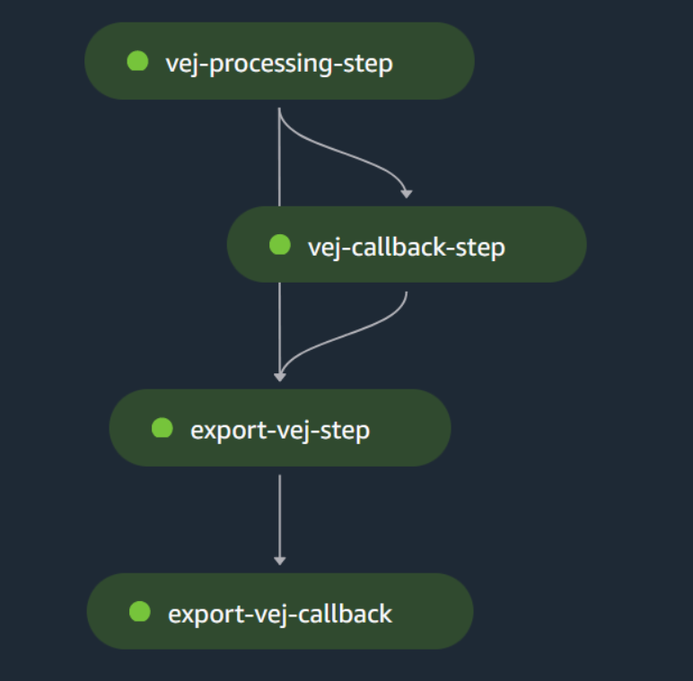

# Create and run a SageMaker geospatial pipeline using the SDK for Kotlin

## Overview

This scenario demonstrates how to work with Amazon SageMaker pipelines and geospatial jobs.

A [SageMaker pipeline](https://docs.aws.amazon.com/sagemaker/latest/dg/pipelines.html) is a series of 
interconnected steps that can be used to automate machine learning workflows. You can create and run pipelines from SageMaker Studio by using Python, but you can also do this by using AWS SDKs in other
languages. Using the SDKs, you can create and run SageMaker pipelines and also monitor operations for them.

### Pipeline steps
This example pipeline includes an [AWS Lambda step](https://docs.aws.amazon.com/sagemaker/latest/dg/build-and-manage-steps.html#step-type-lambda) 
and a [callback step](https://docs.aws.amazon.com/sagemaker/latest/dg/build-and-manage-steps.html#step-type-callback). 
Both steps are processed by the same example Lambda function. 

This Lambda code is included as part of this example, with the following functionality:
- Starts the SageMaker Vector Enrichment Job with the provided job configuration.
- Starts the export function with the provided export configuration.
- Processes Amazon Simple Queue Service (Amazon SQS) messages from the SageMaker pipeline.  

### Pipeline parameters
The example pipeline uses [parameters](https://docs.aws.amazon.com/sagemaker/latest/dg/build-and-manage-parameters.html) that you can reference throughout the steps. You can also use the parameters to change
values between runs. In this example, the parameters are used to set the Amazon Simple Storage Service (Amazon S3)
locations for the input and output files, along with the identifiers for the role and queue to use in the pipeline. 
The example demonstrates how to set and access these parameters.

### Geospatial jobs
A SageMaker pipeline can be used for model training, setup, testing, or validation. This example uses a simple job
for demonstration purposes: a [Vector Enrichment Job (VEJ)](https://docs.aws.amazon.com/sagemaker/latest/dg/geospatial-vej.html) that processes a set of coordinates to produce human-readable 
addresses powered by Amazon Location Service. Other types of jobs could be substituted in the pipeline instead.

## ⚠ Important

* Running this code might result in charges to your AWS account.
* Running the tests might result in charges to your AWS account.
* We recommend that you grant your code least privilege. At most, grant only the minimum permissions required to perform the task. For more information, see [Grant least privilege](https://docs.aws.amazon.com/IAM/latest/UserGuide/best-practices.html#grant-least-privilege).
* This code is not tested in every AWS Region. For more information, see [AWS Regional Services](https://aws.amazon.com/about-aws/global-infrastructure/regional-product-services).

## Scenario

### Prerequisites

To use this tutorial, you need the following:

+ An AWS account
+ A Java IDE (this tutorial uses the IntelliJ IDE)
+ Java JDK 1.8
+ Gradle 6.8 or higher
+ Setup your development environment. For more information, see [Setting up the AWS SDK for Kotlin](https://docs.aws.amazon.com/sdk-for-kotlin/latest/developer-guide/setup.html).

To view pipelines in SageMaker Studio, you need to [set up an Amazon SageMaker Domain](https://docs.aws.amazon.com/sagemaker/latest/dg/gs-studio-onboard.html).

To use geospatial capabilities, [you need to use a supported Region](https://docs.aws.amazon.com/sagemaker/latest/dg/geospatial.html).

You must download and use these files to successfully run this code example:

+ GeoSpatialPipeline.json
+ latlongtest.csv

These files are located on GitHub in [AWS SDK for .NET](https://github.com/awsdocs/aws-doc-sdk-examples/tree/main/dotnetv3/SageMaker/Scenarios).

### Kotlin Lambda Function

To successfully run this example, you need to create the Kotlin Sagemaker Lambda function by creating a .jar file and then placing the .jar file into an Amazon S3 bucket. You can find this project here: [Create the SageMaker geospatial Lambda function using the AWS SDK for Kotlin](https://github.com/awsdocs/aws-doc-sdk-examples/tree/main/kotlin/usecases/workflow_sagemaker_lambda).  

### Instructions

You can run this Kotlin code example from within your IDE.

#### Get started with geospatial jobs and pipelines

This example shows you how to do the following:

* Set up resources for a pipeline.
* Set up a pipeline that runs a geospatial job.
* Start a pipeline run.
* Monitor the status of the run.
* View the output of the pipeline.
* Clean up resources.

## Additional resources

* [SageMaker Developer Guide](https://docs.aws.amazon.com/sagemaker/latest/dg/whatis.html)
* [SageMaker API Reference](https://docs.aws.amazon.com/sagemaker/latest/APIReference/Welcome.html)
* [Kotlin Developer Guide](https://docs.aws.amazon.com/sdk-for-kotlin/latest/developer-guide/home.html)

---

Copyright Amazon.com, Inc. or its affiliates. All Rights Reserved.