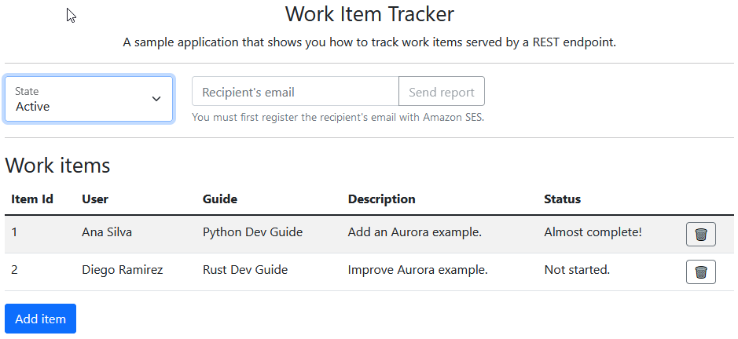

#  Tracking work items in an Aurora Serverless database with the SDK for Python

## Overview

This example shows you how to use the AWS SDK for Python (Boto3) to create a REST 
service that lets you do the following:

* Read, write, and update work items that are stored in an Amazon Aurora Serverless
  database.
* Use Amazon Simple Email Service (Amazon SES) to send email reports of work items.

## ⚠️ Important
* Running this code might result in charges to your AWS account. 
* Running the tests might result in charges to your AWS account.
* We recommend that you grant your code least privilege. At most, grant only the minimum permissions required to perform the task. For more information, see [Grant least privilege](https://docs.aws.amazon.com/IAM/latest/UserGuide/best-practices.html#grant-least-privilege). 
* This code is not tested in every AWS Region. For more information, see [AWS Regional Services](https://aws.amazon.com/about-aws/global-infrastructure/regional-product-services).

## Running the example

### Prerequisites

Prerequisites for running this example can be found in the 
[README](../../README.md#Prerequisites) in the Python folder and in the package lists
for each component.

### Creating AWS resources

The AWS resources for this example can be created by running the AWS CloudFormation 
`setup.yaml` script in 
[resources/cdk/aurora_serverless_app](../../../resources/cdk/aurora_serverless_app).
For instructions on how to run the script, see the [README](../../../resources/cdk/aurora_serverless_app/README.md). 

### Creating the work items table

After you have created the Aurora DB cluster and database, you must create a table to
contain work items. You can do this by using either the AWS Command Line Interface 
(AWS CLI) or the AWS Management Console.

#### AWS CLI

Use the AWS CLI to create the `work_items` table by running the following command at a 
command prompt. Before you run, replace the following values with the output from the 
CloudFormation setup script:

* **CLUSTER_ARN** — Replace with the ARN of the Aurora DB cluster, such as 
`arn:aws:rds:us-west-2:123456789012:cluster:doc-example-aurora-app-docexampleauroraappcluster-15xfvaEXAMPLE`.
* **SECRET_ARN** — Replace with the ARN of the secret that contains your database
credentials, such as `arn:aws:secretsmanager:us-west-2:123456789012:secret:docexampleauroraappsecret8B-xI1R8EXAMPLE-hfDaaj`.
* **DATABASE** — Replace with the name of the database, such as `auroraappdb`.  

*Tip:* The caret `^` is the line continuation character for a Windows command prompt.
If you run this command on another platform, replace the caret with the line continuation
character for that platform.

```
aws rds-data execute-statement ^
    --resource-arn "CLUSTER_ARN" ^
    --database "DATABASE" ^
    --secret-arn "SECRET_ARN" ^
    --sql "create table work_items (work_item_id INT AUTO_INCREMENT PRIMARY KEY, created_date TIMESTAMP DEFAULT CURRENT_TIMESTAMP, description TEXT, guide TEXT, status TEXT, username VARCHAR(45), archive BOOL DEFAULT 0);"
```

#### AWS Management Console

Use the Console to create the `work_items` table with the following steps:

1. Browse to the [Amazon RDS console](https://console.aws.amazon.com/rds).
2. Select *Query Editor*.
3. For *Database instance or cluster*, choose your database instance. If you used the 
CloudFormation script to create your AWS resources, the name begins with 
`doc-example-aurora-app-`.
4. For *Database username*, choose *Connect with a Secrets Manager ARN*. 
5. Enter the ARN of the secret that contains your database credentials, such as 
`arn:aws:secretsmanager:us-west-2:123456789012:secret:docexampleauroraappsecret8B-xI1R8EXAMPLE-hfDaaj`. 
6. For *Enter the name of the database or schema*, enter the name of your database, such
as `auroraappdb`.
7. Select *Connect to database*.

This opens a SQL query console. You can run any SQL queries here that you want. Run the 
following to create the `work_items` table:

```sql
create table work_items (
  work_item_id INT AUTO_INCREMENT PRIMARY KEY,
  created_date TIMESTAMP DEFAULT CURRENT_TIMESTAMP, 
  description TEXT, 
  guide TEXT, 
  status TEXT, 
  username VARCHAR(45), 
  archive BOOL DEFAULT 0
);
```

### REST service

This example uses [Flask-RESTful](https://flask-restful.readthedocs.io/en/latest/) to
build a REST API and host a local web server in debug mode.

#### Prerequisites

Install the packages need to run the web server and REST service by running the 
following in a virtual environment at a command prompt:

```
python -m pip install -r requirements.txt
``` 

#### Configuration

Replace the values in [config.py](config.py) with the values for the AWS resources
used by the example.

* **CLUSTER_ARN** — Replace with the ARN of the Aurora DB cluster, such as 
`arn:aws:rds:us-west-2:123456789012:cluster:doc-example-aurora-app-docexampleauroraappcluster-15xfvaEXAMPLE`.
* **SECRET_ARN** — Replace with the ARN of the secret that contains your database
credentials, such as `arn:aws:secretsmanager:us-west-2:123456789012:secret:docexampleauroraappsecret8B-xI1R8EXAMPLE-hfDaaj`.
* **DATABASE** — Replace with the name of the database, such as `auroraappdb`.  
* **TABLE_NAME** — Replace with the name of the work item table, such as `work_items`.
* **SENDER_EMAIL** — Replace with an email address that is registered with Amazon SES. 

The example sends an email report by using Amazon SES. When your account is in the
sandbox, you must register both the sender and recipient email addresses. You can
do this by using [the console](https://console.aws.amazon.com/ses).

*Tip:* For this example, you can register the same email account for both the sender and 
the recipient.

#### Running the web server

Start a local web server in debug mode by running the following at a command prompt:

```
python app.py
```

This starts the Flask web server in debug mode on http://localhost:5000.

### Webpage

The REST service is intended to be used in conjunction with the 
[Work item tracker web client](../../../resources/clients/react/item-tracker).
The web client is built with React and sends HTTP requests to the REST service.

Follow the instructions in the [README](../../../resources/clients/react/item-tracker/README.md)
to install the necessary prerequisites for the client. Configure the endpoint
to send requests to the local web server at http://localhost:5000.

Start the webpage in development mode by running the following at a command prompt
in the [Work item tracker web client](../../../resources/clients/react/item-tracker) folder:

```
npm start
```

This compiles the project and browses to it at http://localhost:3000.

### Using the app

When you first start, the application shows that your database contains no work items.

---


---

After you add work items, you'll see them in the table.

---



---

You can archive work items, query for work items by state, and send an email report. 

## Deleting the resources

To avoid charges, delete all the resources that you created for this tutorial.
Follow the instructions in the [Destroying resources](../../../resources/cdk/aurora_serverless_app#destroying-resources)
section of the README for the Aurora Serverless sample application.

## Next steps

Congratulations! You have built a web application that reads, writes, and archives 
work items that are stored in an Amazon Aurora Serverless database, and that uses 
Amazon SES to send email to a registered user.

## Additional resources
* [Cross-service examples](../README.md)
* [Amazon Aurora User Guide](https://docs.aws.amazon.com/AmazonRDS/latest/AuroraUserGuide/CHAP_AuroraOverview.html)
* [Amazon RDS User Guide](https://docs.aws.amazon.com/AmazonRDS/latest/UserGuide/Welcome.html)
* [Amazon SES Developer Guide](https://docs.aws.amazon.com/ses/latest/dg/Welcome.html)
* [Amazon RDS Data Service API Reference](https://docs.aws.amazon.com/rdsdataservice/latest/APIReference/Welcome.html)
* [Amazon SES API Reference](https://docs.aws.amazon.com/ses/latest/APIReference/Welcome.html)
* [Amazon RDS Data Service Boto3 API Reference](https://boto3.amazonaws.com/v1/documentation/api/latest/reference/services/rds-data.html)
* [Amazon SES Boto3 API Reference](https://boto3.amazonaws.com/v1/documentation/api/latest/reference/services/ses.html)

---
Copyright Amazon.com, Inc. or its affiliates. All Rights Reserved.

SPDX-License-Identifier: Apache-2.0
