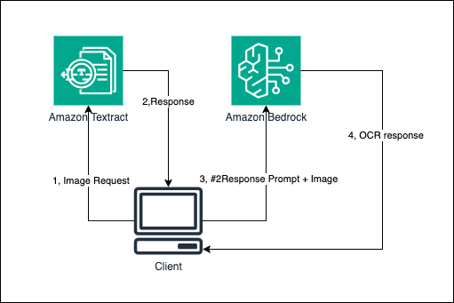
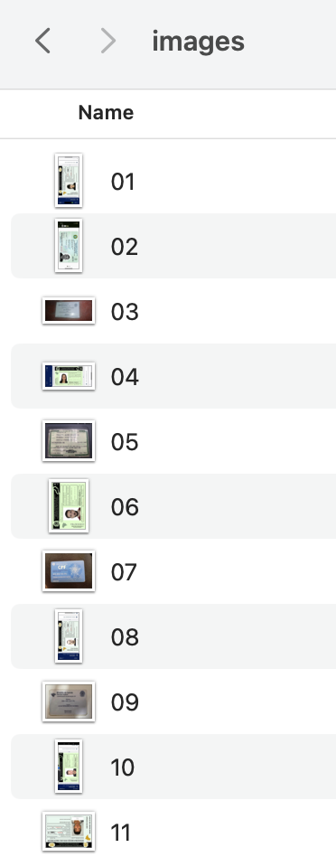
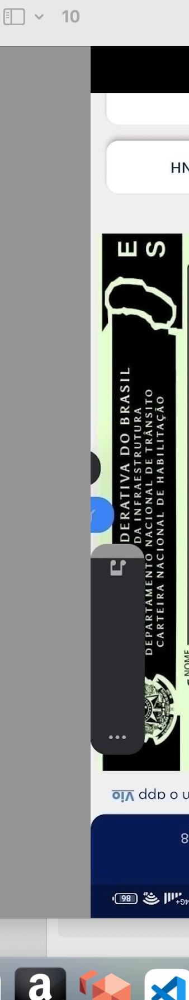

# GenAI - OCR Document Recognition in KYC Scenarios

## Background

In KYC (Know Your Customers) applications, a typical scenario requires users to upload identification documents for automated information extraction. While traditional manual information extraction has become obsolete due to low efficiency, professional OCR tools have become the standard solution.

### Professional OCR Tools

Normally uses image preprocessing techniques (noise reduction, binarization, tilt correction), and it employs deep learning algorithms (CNN, LSTM) for text detection.

#### Advantages:
- Supports multi-language recognition
- Can preserve table structures
- Handles complex layout analysis
- Adapts to low-quality images and handwriting
- Easy to integrates via APIs

#### Limitations:
- Limited generalization capabilities
- Less flexible compared to LLMs
- Cannot perform accurate intent recognition
- Unable to make complex inferences (e.g., you can not ask complex questions to OCR Tools)

### Multimodal Large Language Models (MM-LLM)

MM-LLM combined the ability to "read" images as well as the ability of thought. 
#### Advantages:
- generalization capabilities, can answer questions directly from the image.

#### Limitations (as of March 21, 2025):
- Lower "visual acuity" compared to OCR, Significant accuracy drop with tilted images
- Particularly challenging with user-submitted photos that may be rotated or flipped

## Solution: AWS OCR + LLM Integration

Based on the facts above, we introduce solution combine with OCR (Amazon Textract) + LLM (Amazon Bedrock). Solution architecture as below:
<p align="center">
 
</p> 

### Architecture Flow:
1. Client sends image to Amazon Textract for parsing
2. Amazon Textract returns parsing results
3. Client sends Textract results as part of the prompt along with original image to LLM
4. LLM returns final analysis results

### Implementation

See app.y

#### Sample Prompt
```python
prompt = f"""
<ocr_results>
{ocr_text}
</ocr_results>
Analyze this image and corresponding OCR results, carefully and provide the following information:
1. Name: Extract the full name of the person from the document.
2. CPF: Extract the CPF number (Brazilian tax identification number) if present.
3. DOB: Extract the date of birth in the format YYYY-MM-DD.
4. Text Language: Identify the primary language of the text in the image.
Format your response as follows:
Name: [Full Name]
CPF: [CPF Number]
DOB: [YYYY-MM-DD]
Text Language: [Language]
If you can't find or determine any of these fields, use 'Unknown'.Please note the picture can be tilted.
"""
```

## Performance Analysis

### Source data:
<p align="center">
 
</p> 


### Results

```
(env-01) xueybai@80a99721cf60 project % python txtract+llm.py
{
"fileFullName": "./images/10.jpeg",
"textLanguage": "Portuguese",
"Name": "Unknown",
"CPF": "xxxxxxx",
"DOB": "Unknown"
}
————————————————————————————————————————
{
"fileFullName": "./images/06.jpeg",
"textLanguage": "Portuguese",
"Name": "VAGNER TAVARES DE OLIVEIRA",
"CPF": "xxxxxxxx",
"DOB": "xxxxxxxx"
}
————————————————————————————————————————
{
"fileFullName": "./images/07.jpeg",
"textLanguage": "Portuguese",
"Name": "CICERA EUGENIA DOS SANTOS",
"CPF": "xxxxxxxx",
"DOB": "xxxxxxxx"
}
————————————————————————————————————————
{
"fileFullName": "./images/01.jpeg",
"textLanguage": "Portuguese/English (Bilingual document)",
"Name": "FRANCIELE DANIELA RODRIGUES",
"CPF": "xxxxxxxx",
"DOB": "xxxxxxxx"
}
————————————————————————————————————————
{
"fileFullName": "./images/11.png",
"textLanguage": "Portuguese",
"Name": "THALES HENRIQUE MOGARI",
"CPF": "xxxxxxxx",
"DOB": "xxxxxxxx"
}
————————————————————————————————————————
{
"fileFullName": "./images/02.jpeg",
"textLanguage": "Portuguese",
"Name": "LUIS FELIPE GONCALVES NOGUEIRA DA SILVA",
"CPF": "xxxxxxxx",
"DOB": "xxxxxxxx"
}
————————————————————————————————————————
{
"fileFullName": "./images/03.jpeg",
"textLanguage": "Portuguese",
"Name": "LUCAS DENILSON DA SILVA COSTA",
"CPF": "xxxxxxxx",
"DOB": "xxxxxxxx"
}
————————————————————————————————————————
{
"fileFullName": "./images/04.jpeg",
"textLanguage": "Portuguese",
"Name": "JESSICA OLIVEIRA DE SOUSA",
"CPF": "xxxxxxxx",
"DOB": "xxxxxxxx"
}
————————————————————————————————————————
{
"fileFullName": "./images/08.jpeg",
"textLanguage": "Portuguese/English (Bilingual document)",
"Name": "Arthur Marcel Dos Santos",
"CPF": "xxxxxxxx",
"DOB": "xxxxxxxx"
}
————————————————————————————————————————
{
"fileFullName": "./images/09.jpeg",
"textLanguage": "Portuguese",
"Name": "LUCAS FERNANDES DE OLIVEIRA",
"CPF": "xxxxxxxx",
"DOB": "xxxxxxxx"
}
————————————————————————————————————————
{
"fileFullName": "./images/05.jpeg",
"textLanguage": "Portuguese",
"Name": "THALITA ALVES SIQUEIRA",
"CPF": "xxxxxxxx",
"DOB": "xxxxxxxx"
}
————————————————————————————————————————
```

### Result summary:
- Tested with 11 sample images in various orientations
- 10 out of 11 images were accurately recognized
- Only image #10 (with significant contamination) failed recognition
- System successfully handled various image orientations

The reason that #10 failed is because it was tainted so as expected

<p align="center">
 
</p> 


### Cost Analysis


For processing 1 document:
| Service | Average Usage per Image | Unit Price | Total Price | Notes |
|---------|------------------------|------------|-------------|--------|
| Amazon Textract | 1 | $0.0015 USD | $0.0015 USD | - |
| Amazon Bedrock Sonnet V2 | Input: 1300 tokens<br>Output: 500 tokens | Input: $0.003/1K tokens<br>Output: $0.015/1K tokens | $0.0105 USD | Image input tokens ≈ pixels/750 |
| **Total** | - | - | **$0.012 USD** | - |

