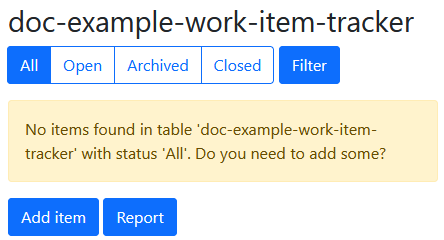
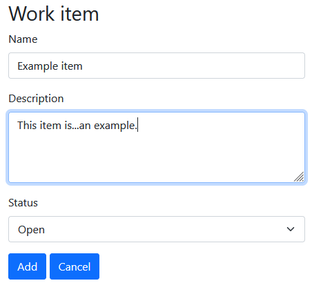
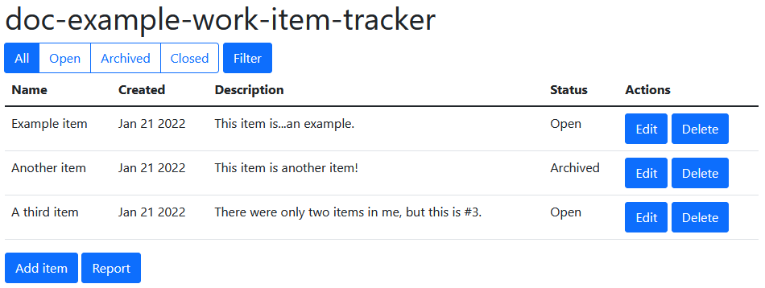
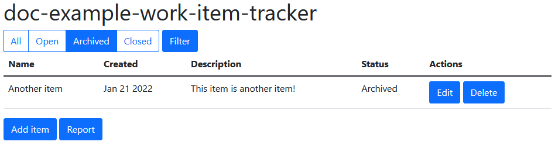
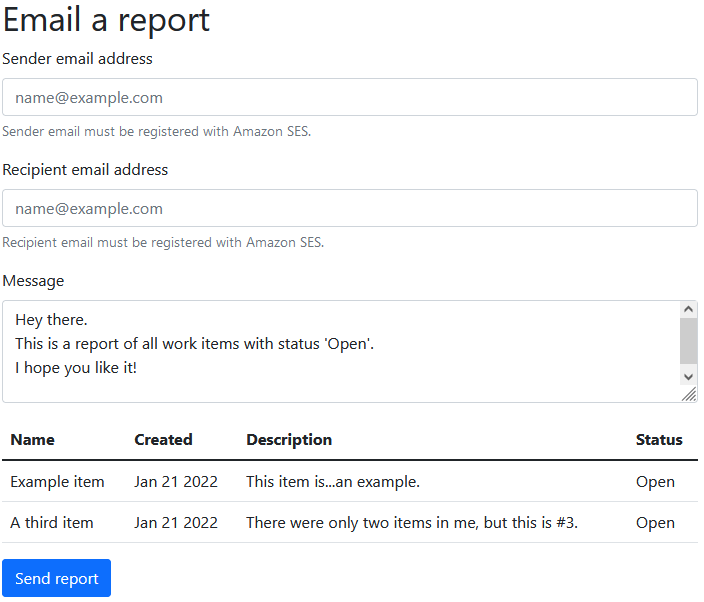

#  Track work items in a DynamoDB table with the SDK for Python

## Overview

This example shows you how to use the AWS SDK for Python (Boto3) to create a REST 
service that lets you do the following:

* Build a Flask REST service that integrates with AWS services.
* Read, write, and update work items that are stored in an Amazon DynamoDB table.
* Use Amazon Simple Email Service (Amazon SES) to send email reports of work items.

The REST service is used in conjunction with the [Elwing React client](../../../resources/clients/react/elwing)
to present a fully functional web application.

### ⚠️ Important
* Running this code might result in charges to your AWS account. 
* Running the tests might result in charges to your AWS account.
* We recommend that you grant your code least privilege. At most, grant only the minimum 
  permissions required to perform the task. For more information, see 
  [Grant least privilege](https://docs.aws.amazon.com/IAM/latest/UserGuide/best-practices.html#grant-least-privilege). 
* This code is not tested in every AWS Region. For more information, see 
  [AWS Regional Services](https://aws.amazon.com/about-aws/global-infrastructure/regional-product-services).

### Prerequisites

Prerequisites for running examples can be found in the 
[README](../../README.md#Prerequisites) in the Python folder.

In addition to the standard prerequisites, this example also requires:

* Flask 2.2.0 or later
* Flask-Cors 3.0.10 or later
* webargs 8.2.0 or later

You can install all of the prerequisites by running the following in a virtual environment:

```
python -m pip install -r requirements.txt
```
 
## Create the resources

### Work item table

This example requires a DynamoDB table that has a String partition key named `iditem`.

#### AWS CDK and AWS CLI deployment
 
Follow the instructions in the 
[README for the DynamoDB item tracker](/resources/cdk/dynamodb-item-tracker/README.md) 
to use the AWS Cloud Development Kit (AWS CDK) or AWS Command Line Interface
(AWS CLI) to create and manage the table resource. 

#### Console deployment

If you prefer, you can deploy the resources for the application by using the 
[AWS Management Console](https://docs.aws.amazon.com/awsconsolehelpdocs/latest/gsg/learn-whats-new.html).
To deploy with the console, take the following steps:

1. Open the console in your browser.
1. Navigate to DynamoDB and create a table named `doc-example-work-item-tracker`
with a partition key of String type named `iditem`.

### Verified email address

To email reports from the app, you must register at least one email address with 
Amazon SES. This verified email is specified as the sender for emailed reports.

1. In a browser, navigate to the [Amazon SES console](https://console.aws.amazon.com/ses/).
1. If necessary, select your AWS Region.
1. Select **Verified identities**.
1. Select **Create identity**.
1. Select **Email address**.
1. Enter an email address you own.
1. Select **Create identity**.
1. You will receive an email from Amazon Web Services that contains instructions on how
to verify the email with Amazon SES. Follow the instructions in the email to complete
verification.

*Tip:* For this example, you can use the same email account for both the sender and 
the recipient.

## Run the example 

### REST service

#### Configure the service

Before you run the service, enter your DynamoDB table name and verified email address
in `config.py`, similar to the following:

```
TABLE_NAME = 'doc-example-work-item-tracker'
SENDER_EMAIL = 'your_name@example.com'
```

#### Run the service

This example uses [Flask](https://flask.palletsprojects.com/en/2.0.x/) to host a local 
web server and REST service. With the web server running, you can send HTTP requests to
the service endpoint to list, add, and update work items and to send email reports.

Run the app at a command prompt to start the Flask web server. Specify the `--debug`
flag for more detailed output during development, and specify a port of 8080 to work
with the Elwing client.

```
flask --debug run -p 8080
```

### Webpage

The REST service is designed to work with the item tracker plugin in the Elwing web
client. The item tracker plugin is a JavaScript application that lets you manage work 
items, send requests to the REST service, and see the results.

#### Run Elwing and select the item tracker

1. Run Elwing by following the instructions in the [Elwing README](/resources/clients/react/elwing/README.md).
1. When Elwing starts, a web browser opens and browses to http://localhost:3000/.
1. Run the item tracker plugin by selecting **Item Tracker** in the left navigation bar.
1. This sends a request to the REST service to get any existing active items:
   ```
   GET http://localhost:8080/api/items?archived=false
   ```
1. At first, the table is empty.

    

1. Select **Add item**, fill in the values, and select **Add** to add an item.

    

   This sends a POST request to the REST service with a JSON payload that contains the
   work item.

   ```
   POST http://localhost:8080/api/items
   {"name":"Me",
    "guide":"python",
    "description":"Show how to add an item",
    "status":"In progress",
    "archived":false}
   ```

1. After you've added items, they're displayed in the table. You can archive an active 
   item by selecting the **Archive** button next to the item.

    

   This sends a PUT request to the REST service, specifying the item ID and the
   `archive` action. 
   
   ```
   PUT http://localhost:8080/api/items/8db8aaa4-6f04-4467-bd60-EXAMPLEGUID:archive
   ```
   
1. Select a filter in the dropdown list, such as **Archived**, to get and display
only items with the specified status.

    

   This sends a GET request to the REST service with an `archived` query parameter.
   
   ```
   GET http://localhost:8080/api/items?archived=true
   ```

1. Enter an email recipient and select **Send report** to send an email of active items.

    

   This sends a POST request to the REST service with a `report` action.
   
   ```
   POST http://localhost:8080/api/items:report
   ```
    
   When your Amazon SES account is in the sandbox, both the sender and recipient
   email addresses must be registered with Amazon SES.

## Understand the example

This example uses the Flask web framework to host a local REST service and respond to
HTTP requests.

### Routing

The [app.py](app.py) file configures the app, creates Boto3 resources, and sets up 
URL routing. This example uses Flask's `MethodView` class to help with routing.

In this file, you can find route definitions like the following, which routes a GET
request to `/api/items` to the `ItemList.get` method:

```python
item_list_view = ItemList.as_view('item_list_api', storage)
app.add_url_rule(
    '/api/items', defaults={'iditem': None}, view_func=item_list_view, methods=['GET'],
    strict_slashes=False)
```  

### REST methods

HTTP requests are routed to methods in the [ItemList](item_list.py) and 
[Report](report.py) classes, which use webargs and marshmallow to handle argument 
parsing and data transformation.

For example, the work item schema includes a field that is named `id` in the webpage,
but is named `iditem` in the data table. By defining a `data_key`, the marshmallow 
schema transforms this field automatically. 

```python
class WorkItemSchema(Schema):
    iditem = fields.Str(data_key='id')
``` 

The `ItemList` class contains methods that handle REST requests and use the
`@use_args` and `@use_kwargs` decorators from webargs to parse incoming arguments.

For example, the `get` method uses `@use_kwargs` to parse fields contained in the query 
string into arguments in the method signature, and then calls the underlying `storage`
object to get work items from the DynamoDB table.

```python
@use_kwargs(WorkItemSchema, location='query')
def get(self, iditem, archived=None):
    work_items = self.storage.get_work_items(archived)
```

### DynamoDB storage

The [storage.py](storage.py) file contains functions that get and set data in DynamoDB
by using a Boto3 Table object. This object is a high-level object that wraps low-level
DynamoDB service actions.
 
For example, the `get_work_items` function scans the table for work items with a 
specified `archived` status:

```python
def get_work_items(self, archived=None):
    work_items = self.table.scan(
        FilterExpression=Attr('archived').eq(archived)).get('Items', [])
```

### Amazon SES report

The [report.py](report.py) file contains functions that send an email report of work 
items to a specified email address.

When 10 or fewer work items are included in the report, the work item list is included 
directly in the email body, with both HTML and text versions. This style of report is
sent by using the `send_email` service action, which lets you send the HTML and text
body as plain Python strings.

When the list is larger than 10 work items, it is rendered in CSV format and included 
as an attachment to the email. When you use Amazon SES to send an attachment, you must 
use the `send_raw_email` service action and send the email in MIME format. 

## Delete the resources

To avoid charges, delete all the resources that you created for this tutorial.

If you created the example resources by using the AWS CDK or AWS CLI,
you can destroy the resources by following the instructions in the 
[README for the DynamoDB item tracker](/resources/cdk/dynamodb-item-tracker/README.md). 

If you created your resources through the AWS Management Console, or modified them by 
running the app, you must use the console to delete them.

## Next steps

Congratulations! You have built a REST service that reads, writes, and archives 
work items that are stored in an Amazon DynamoDB table. It also uses 
Amazon SES to send email to a registered user.

## Additional information

* [DynamoDB Developer Guide](https://docs.aws.amazon.com/amazondynamodb/latest/developerguide/Introduction.html)
* [Amazon SES Developer Guide](https://docs.aws.amazon.com/ses/latest/dg/Welcome.html)
* [Boto3 DynamoDB service reference](https://boto3.amazonaws.com/v1/documentation/api/latest/reference/services/dynamodb.html)
* [Amazon SES Boto3 API Reference](https://boto3.amazonaws.com/v1/documentation/api/latest/reference/services/ses.html)

---
Copyright Amazon.com, Inc. or its affiliates. All Rights Reserved.

SPDX-License-Identifier: Apache-2.0
