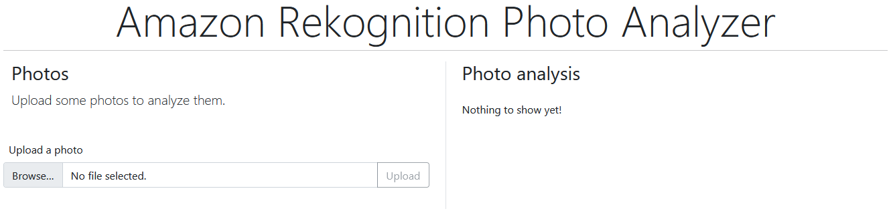
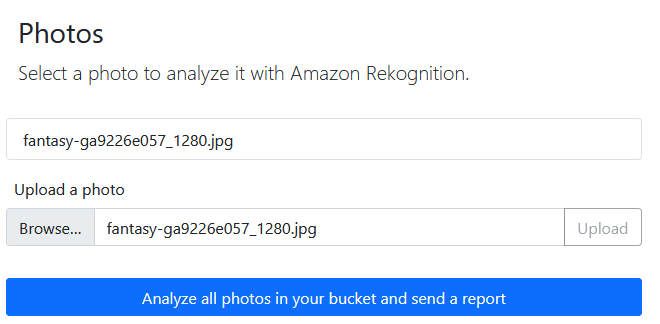
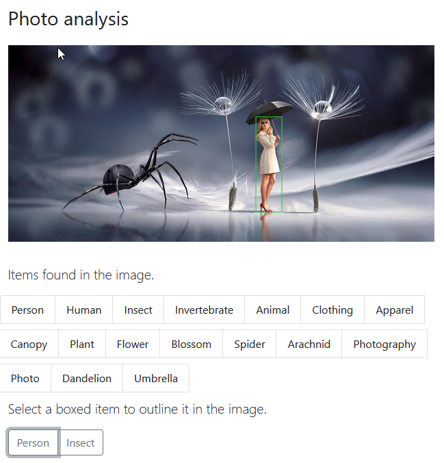
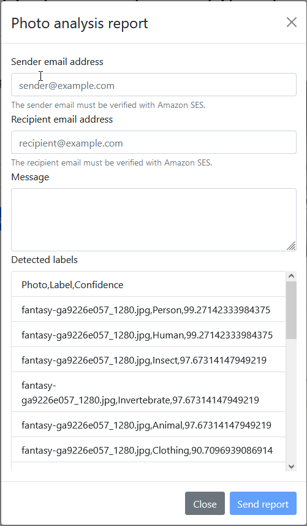
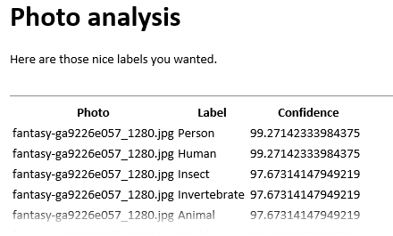

#  Analyzing photos using Amazon Rekognition with the AWS SDK for Python

## Overview

Shows you how to use the AWS SDK for Python (Boto3) to create a web application that 
lets you upload photos to an Amazon Simple Storage Service (Amazon S3) bucket, use 
Amazon Rekognition to analyze and label the photos, and use Amazon Simple Email 
Service (Amazon SES) to send email reports of image analysis.  

This example contains two main components: a web page written in JavaScript that is built
with React, and a REST service written in Python that is built with Flask-RESTful.

You can use the React web page to:

* Display a list of images that are stored in your S3 bucket.
* Upload images from your computer to your S3 bucket.
* Display images and labels that identify items that were detected in the image.
* Get a report of all images in your S3 bucket and send an email of the report.

The web page calls the REST service. The service sends requests to AWS to
perform the following actions:

* Get and filter the list of images in your S3 bucket.
* Upload photos to your S3 bucket.
* Use Amazon Rekognition to analyze individual photos and get a list of labels that
  identify items that are detected in the photo.
* Analyze all photos in your S3 bucket and use Amazon SES to email a report.

## ⚠️ Important
* Running this code might result in charges to your AWS account. 
* Running the tests might result in charges to your AWS account.
*  We recommend that you grant your code least privilege. At most, grant only the minimum permissions required to perform the task. For more information, see [Grant least privilege](https://docs.aws.amazon.com/IAM/latest/UserGuide/best-practices.html#grant-least-privilege). 
* This code is not tested in every AWS Region. For more information, see [AWS Regional Services](https://aws.amazon.com/about-aws/global-infrastructure/regional-product-services).

### Prerequisites

#### Web page

The requirements for the web page are listed in the accompanying `package.json` file.
You will need recent versions of Node.js and npm to install the requirements. 

* Node.js 16.14.2
* npm 8.5.0

Install the web page requirements by running the following in the `frontend` folder
at a command prompt:

```
npm install
```

This installs components like React, React-Bootstrap, and jQuery.

#### REST service

The requirements for the REST service are listed in the accompanying `requirements.txt`
file. You will need recent versions of Python and pip to the install the requirements.

* Python 3.8.8
* pip 21.1.2

Install the REST service components by running the following in the `api` folder in 
a virtual environment:

```
python -m pip install -r requirements.txt
```  

This installs components like Boto3, Flask, and Flask-RESTful.  

## Creating the resources 

### Photo bucket

The example requires an S3 bucket to store photos. You can create an S3 bucket by
using the [AWS Management Console](https://s3.console.aws.amazon.com/s3).

After you create your bucket, update the `BUCKET_NAME` field in `api\config.py` with
the name of your bucket.

### Email addresses

The example sends an email report by using Amazon SES. When your account is in the
sandbox, you must register both the sender and recipient email addresses. You can
do this by using [the console](https://console.aws.amazon.com/ses).

*Tip:* for this example, you can register the same email account as both the sender and 
the recipient.

## Running the code

### REST service

Start the REST service by running the following at a command prompt in the `api` folder:

```
python app.py
```

This starts the Flask web server in debug mode on http://localhost:5000.

### Web page

Start the web page in development mode by running the following at a command prompt
in the `frontend` folder:

```
npm start
```

This compiles the project and browses to it at http://localhost:3000.

### Using the app

By default, the application shows that your bucket contains no images.



Select **Browse**, choose a JPG or PNG file, and select **Upload** to upload it to
your S3 bucket.



Select the image in the list to display it along with labels detected by Amazon
Rekognition. When a label includes bounding boxes, it is added to a list of clickable
items. Select one to draw boxes over the image.



Select **Analyze all photos in your bucket and send a report** to use Amazon Rekognition
to analyze all photos in your bucket and display a report.



Fill out the form with sender address, recipient address, and a message. Select 
**Send report** to email the report.



## Deleting the resources

To avoid charges, use the console to delete all the resources that you created for 
this tutorial.

* Empty and delete your S3 bucket.
* Delete your email from SES.

## Next steps

Congratulations! You have built a web application that uploads and lists photos in
an S3 bucket, uses Amazon Rekognition to analyze photos, and uses Amazon SES to send
email to a registered user.

## Additional resources
* [Cross-service examples](../README.md)
* [Amazon Rekognition Developer Guide](https://docs.aws.amazon.com/rekognition/latest/dg/what-is.html)
* [Amazon S3 User Guide](https://docs.aws.amazon.com/AmazonS3/latest/userguide/Welcome.html)
* [Amazon SES Developer Guide](https://docs.aws.amazon.com/ses/latest/dg/Welcome.html)'
* [Amazon Rekognition API reference guide](https://docs.aws.amazon.com/rekognition/latest/APIReference/Welcome.html)
* [Amazon S3 API reference guide](https://docs.aws.amazon.com/AmazonS3/latest/API/Welcome.html)
* [Amazon SES API reference guide](https://docs.aws.amazon.com/ses/latest/APIReference/Welcome.html)
* [Amazon Rekognition Boto3 API reference guide](https://boto3.amazonaws.com/v1/documentation/api/latest/reference/services/rekognition.html)
* [Amazon S3 Boto3 API reference guide](https://boto3.amazonaws.com/v1/documentation/api/latest/reference/services/s3.html)
* [Amazon SES Boto3 API reference guide](https://boto3.amazonaws.com/v1/documentation/api/latest/reference/services/ses.html)

---
Copyright Amazon.com, Inc. or its affiliates. All Rights Reserved.

SPDX-License-Identifier: Apache-2.0