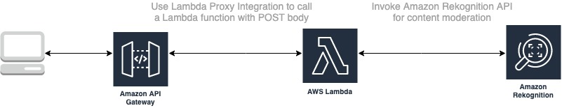

# Amazon Rekognition Content Moderation Solution with URL Support

### Today, Amazon Rekognition doesn't support URLs as input for its APIs. This solution provides a way to invoke Amazon Rekognition, using Amazon API Gateway and AWS Lambda.

## Setup Instructions
- Using AWS CloudFormation, create a stack from cloudformation.yaml
- Once it's done running, copy the Invoke URL from the Outputs tab
- Run a POST request to that URL with a request body containing a "url" element with the image as its value.

For example:
{
  "url": "<url of jpg, jpeg or png here>"
}

## License Summary

Copyright Amazon.com, Inc. or its affiliates. All Rights Reserved.

SPDX-License-Identifier: Apache-2.0
