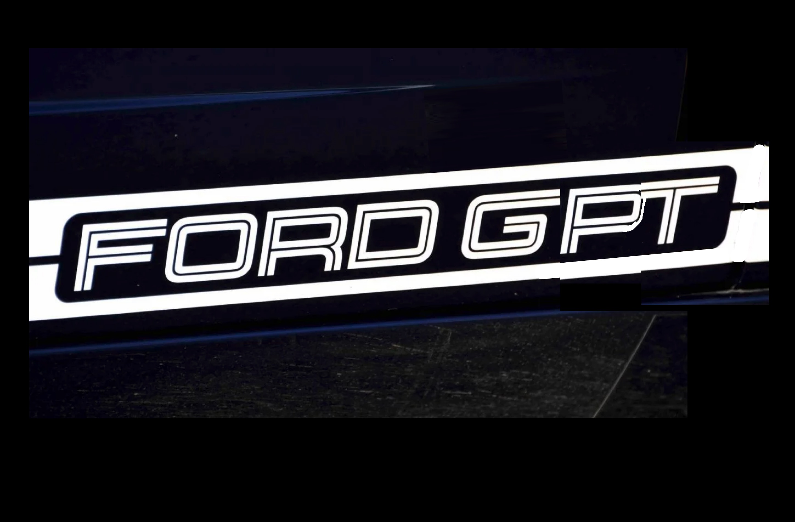

# Running a RAG-enhanced chatbot on Bedrock using Claude 3, Knowledge Base, and LangChain
This directory contains code used for a live demo. It should be run sequentially, as follows:
1. 0_get_models.py
2. 0_try_claude3.py
3. fordgpt_v1.py
4. fordgpt_v2.py
5. fordgpt_v3.py

Note: FordGPTv2-3 (step 4-5) require AWS data stores containing certain information that is not included in this repository.

### Usage
This is reference code that should not be copied directly into production without review.

Running foundation models costs money. This demo presumes you have billing alarms configured and an understanding of Bedrocking pricing.

## About FordGPT

# Requirements
Speaks fluently on:
* Popular companies
* Meetup groups & events
* Best coffee shops for coding
* Fail-safe job hunting resources
