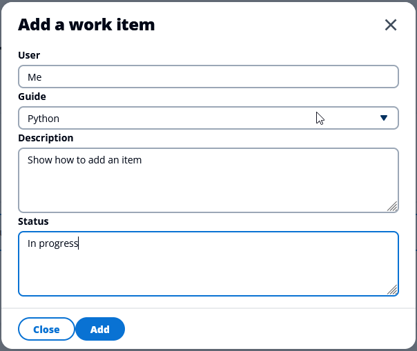

# Work item tracker Elwing Plugin

## Overview

Shows how to use [React](https://reactjs.org/) to create a web page that connects to a REST service that lets you do the following:

- Get a list of active or archived work items.
- Mark active work items as archived.
- Add new work items to the list of active items.
- Send a report of work items to a specified email recipient.

## Sample REST applications

The web client is designed to send requests to one of the following sample applications.
Each sample application shows you how to use an AWS SDK to store work items using AWS
resources:

- [Create a React and Spring REST application that queries Amazon Aurora Serverless data](/javav2/usecases/Creating_Spring_RDS_%20Rest)
- [Create the Amazon Aurora Serverless backend using the AWS SDK for PHP](/php/cross_service/aurora_item_tracker)
- [Track work items in an Aurora Serverless database with the SDK for Python](/python/cross_service/aurora_item_tracker)

## Run the Item Tracker UI

1.  Run Elwing by following the instructions in the [Elwing README](/resources/clients/react/elwing/README.md).
1.  When Elwing starts, a web browser opens http://localhost:3000/.
1.  Run the item tracker plugin by selecting **Item Tracker** in the left navigation bar.
1.  This sends a request to the REST service to get any existing active items:
    ```
    GET http://localhost:8080/api/items?archived=false
    ```
1.  At first, the table is empty.

    

1.  Select **Add item**, fill in the values, and select **Add** to add an item.

    

    This sends a POST request to the REST service with a JSON payload that contains the
    work item.

    ```
    POST http://localhost:8080/api/items
    {"name":"Me",
     "guide":"Rust",
     "description":"Show how to add an item",
     "status":"In progress",
     "archived":false}
    ```

1.  After you add items, they display in the table.
    You can archive an active item by selecting the **Archive** button next to the item.

    

    This sends a PUT request to the REST service, specifying the item ID and the `archive` action.

    ```
    PUT http://localhost:8080/api/items/8db8aaa4-6f04-4467-bd60-EXAMPLEGUID:archive
    ```

1.  To get and display items with a specific status, select a filter in the dropdown list, such as **Archived**.

    

    This sends a GET request to the REST service with an `archived` query parameter.

    ```
    GET http://localhost:8080/api/items?archived=true
    ```

1.  Enter an email recipient and select **Send report** to send an email of active items.

    

    This sends a POST request to the REST service with a `report` action.

    ```
    POST http://localhost:8080/api/items:report
    ```

    When your Amazon Simple Email Service (Amazon SES) account is in the sandbox, both the sender and recipient email addresses must be registered with Amazon SES.

## Additional resources

<!--
- [.NET cross-service examples](/dotnetv3/cross-service/README.md)
- [Go cross-service examples](/gov2/cross_service)
- [JavaScript cross-service examples](/javascriptv3/example_code/cross-services)
- [Java cross-service examples](/javav2/usecases)
- [Kotlin cross-service examples](/kotlin/usecases/Readme.md)
- [Python cross-service examples](/python/cross_service/README.md)
-->

- [Rust cross-service examples](/rust_dev_preview/cross_service/rest_ses/README.md)

---

Copyright Amazon.com, Inc. or its affiliates. All Rights Reserved.

SPDX-License-Identifier: Apache-2.0
