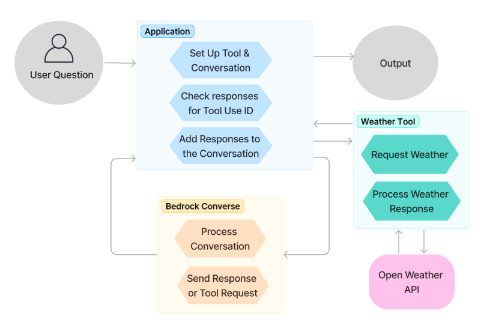

# Bedrock Runtime Converse API with Tool Feature Scenario

## Overview

This example shows how to use AWS SDKs and the Amazon Bedrock Converse API to call a custom tool from a large language model (LLM) as part of a multistep conversation. The example creates a weather tool that leverages the Open-Meteo API to retrieve current weather information based on user input.

[Bedrock Converse API with Tool Definition](https://docs.aws.amazon.com/bedrock/latest/userguide/tool-use-inference-call.html).

This example illustrates a typical interaction between a generative AI model, an application, and connected tools or APIs to solve a problem or achieve a specific goal. The scenario follows these steps:

1. Set up the system prompt and tool configuration.
2. Create a client to interact with Amazon Bedrock. 
3. Prompt the user for their weather request. 
4. Send the user input including the conversation history to the model.
5. The model processes the input and determines if a connected tool or API needs to be used. If this is the case, the model returns a tool use request with specific parameters needed to invoke the tool, and a unique tool use ID to correlate tool responses to the request.
6. The scenario application invokes the tool to fetch weather data, and append the response and tool use ID to the conversation.
7. The model uses the tool response to generate a final response. If additional tool requests are needed, the process is repeated. If the max recursion is reached, the conversation is ended.
8. Once the final response is received and printed, the application returns to the prompt.

### Resources

No additional resources are needed for this scenario.

## Implementations

This example is implemented in the following languages:

- [.NET](../../../dotnetv3/Bedrock-runtime/Scenarios/ConverseToolScenario/README.md)

## Additional resources

- [Documentation: The Amazon Bedrock User Guide](https://docs.aws.amazon.com/bedrock/latest/userguide/what-is-bedrock.html)
- [Tutorials: A developer's guide to Bedrock's new Converse API](https://community.aws/content/2dtauBCeDa703x7fDS9Q30MJoBA/amazon-bedrock-converse-api-developer-guide)
- [More examples: Amazon Bedrock code examples and scenarios in multiple programming languages](https://docs.aws.amazon.com/bedrock/latest/userguide/service_code_examples.html)

---

Copyright Amazon.com, Inc. or its affiliates. All Rights Reserved. SPDX-License-Identifier: Apache-2.0
