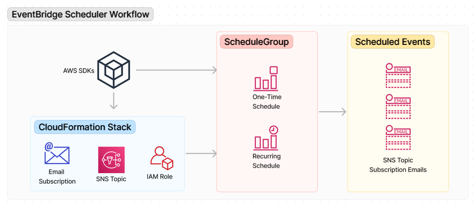

# Amazon EventBridge Scheduler Scenario

## Overview
This example shows how to use AWS SDKs to work with Amazon EventBridge Scheduler with schedules and schedule groups. The scenario demonstrates how to create and delete one-time and recurring schedules within a schedule group to generate events on a specified target, such as an Amazon Simple Notification Service (Amazon SNS) Topic.

The target SNS topic and the AWS Identity and Access Management (IAM) role used with the schedules are created as part of an AWS CloudFormation stack that is deployed at the start of the scenario, and deleted when the scenario is complete.

This scenario demonstrates the following steps and tasks:

1. **Prepare the Application**

   - Prompts the user for an email address to use for the subscription for the SNS topic.
   - Prompts the user for a name for the Cloud Formation stack. 
     - The user must confirm the email subscription to receive event emails.
   - Deploys the Cloud Formation template in resources/cfn_template.yaml for resource creation. 
     - Stores the outputs of the stack into variables for use in the scenario.
   - Creates a schedule group for all scenario schedules.

2. **Create a one-time Schedule**

   - Creates a one-time schedule to send an initial event. 
     - Prompts the user for a name for the one-time schedule.
     - The user must confirm the email subscription to receive an event email.
     - The content of the email should include the name of the newly created schedule.
   - Use a Flexible Time Window of 10 minutes and set the schedule to delete after completion.

3. **Create a time-based schedule**

   - Prompts the user for a rate per minutes (example: every 2 minutes) for a scheduled recurring event.
   - Creates the scheduled event for X times per hour for 1 hour.
   - Deletes the schedule when the user is finished.
     - Prompts the user to confirm when they are ready to delete the schedule.

4. **Clean up**

   - Prompts the user to confirm they want to destroy the stack and clean up all resources.
   - Deletes the schedule group.
   - Destroys the Cloud Formation stack and wait until the stack has been removed.

## Prerequisites

Before running this scenario, ensure you have:

- An AWS account with proper permissions to use Amazon EventBridge Scheduler and Amazon EventBridge.

## AWS Services Used

This scenario uses the following AWS services:

- Amazon EventBridge Scheduler
- Amazon EventBridge
- Amazon Simple Notification Service (SNS)
- AWS CloudFormation

### Resources

The scenario scenario deploys the AWS CloudFormation stack with the required resources.

## Amazon EventBridge Scheduler Actions

The scenario covers the following EventBridge Scheduler API actions:

- [`CreateSchedule`](https://docs.aws.amazon.com/scheduler/latest/APIReference/API_CreateSchedule.html)
- [`CreateScheduleGroup`](https://docs.aws.amazon.com/scheduler/latest/APIReference/API_CreateScheduleGroup.html)
- [`DeleteSchedule`](https://docs.aws.amazon.com/scheduler/latest/APIReference/API_DeleteSchedule.html)
- [`DeleteScheduleGroup`](https://docs.aws.amazon.com/scheduler/latest/APIReference/API_DeleteScheduleGroup.html)

## Implementations

This example is implemented in the following languages:

* [Java](../../../javav2/example_code/scheduler/README.md)
* [Python](../../../python/example_code/scheduler/README.md)
* [.NET](<../../../dotnetv3/EventBridge Scheduler/README.md>)

## Additional resources

* [EventBridge Scheduler User Guide](https://docs.aws.amazon.com/scheduler/latest/UserGuide/what-is-scheduler.html)
* [EventBridge Scheduler API Reference](https://docs.aws.amazon.com/scheduler/latest/APIReference/Welcome.html)

---

Copyright Amazon.com, Inc. or its affiliates. All Rights Reserved.
SPDX-License-Identifier: Apache-2.0
