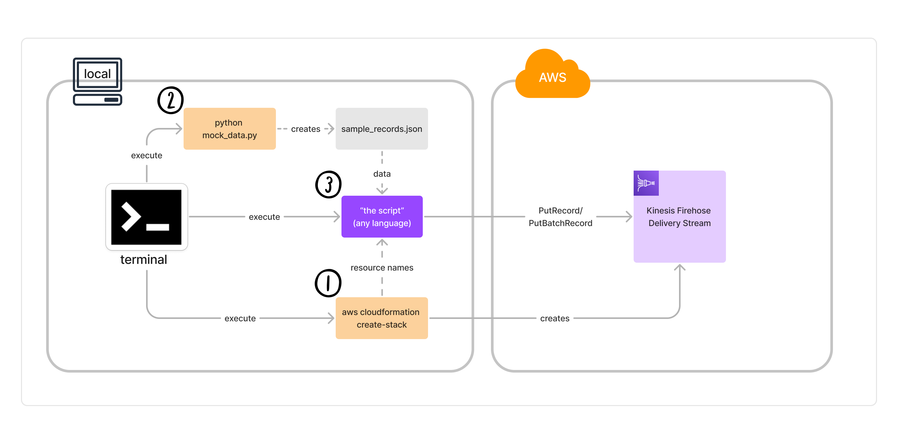
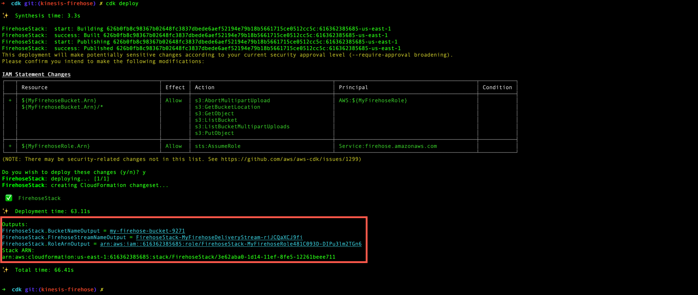
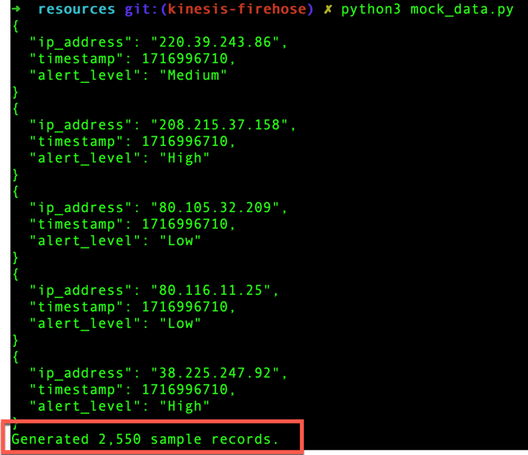
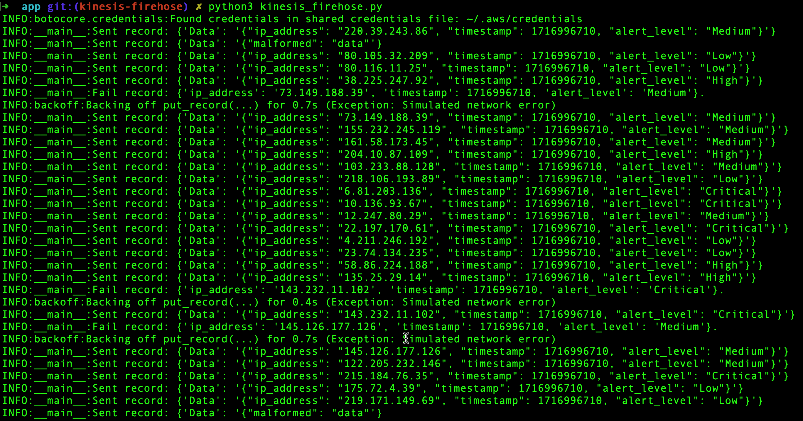

# Amazon Data Firehose Common Actions Workflow

## Overview

This example demonstrates how to use AWS SDKs to work with Amazon Data Firehose, focusing on putting individual records (`PutRecord`) and batches of records (`PutRecordBatch`) to a delivery stream. The workflow showcases creating, configuring, and utilizing a Data Firehose Delivery Stream to handle data ingestion.

### About Data Firehose
[Amazon Data Firehose](https://docs.aws.amazon.com/firehose/latest/dev/what-is-this-service.html) is the easiest way to reliably load streaming data into data lakes, data stores, and analytics services. It can capture, transform, and load streaming data into Amazon S3, Amazon Redshift, Amazon Elasticsearch Service, and Splunk, enabling near real-time analytics with existing business intelligence tools and dashboards.

## Scenario components
This scenario consists of three key user tasks:
1. Create infrastructure using provided CloudFormation template (see [firehose-stack.yaml](resources/firehose-stack.yml)).
2. Create mock data using provided script (see [mock_data.py](resources/mock_data.py)).
3. Execute language-specific script (see [specifications](SPECIFICATION.md)).


## Run this scenario
This script is designed to be executed locally using your own AWS account with minimal customization.

### Pre-requisites

1. **AWS Account**: Ensure you have an active AWS account.
2. **AWS CLI Configured**: Configure AWS CLI with appropriate permissions to create resources with the CFN.
4. **Python >=3.6 Configured**: Install, plus run `pip install -r resources/requirements.txt`.
5. **OPTIONAL: Ailly Configured**: Configure [Ailly](https://github.com/davidsouther/ailly) to use the [start.sh](./start.sh) script to generate a new scenario using AI.

### Setup

1. **Use the [CFN template](./resources/irehose-stack.yml) to create Data Firehose Delivery Stream**:
   - Run the following CLI command:
   ```
   aws cloudformation create-stack \
      --stack-name FirehoseStack \
      --template-body file://resources/firehose-stack.yml \
      --capabilities CAPABILITY_IAM
   ```
   - Output should print the names of the resources created:



2. **Use the provided script to create example data**:
   - Run `python resources/mock_data.py` (requires Python >=3.6, with `faker` library installed)
   - This will create `sample_records.json` containing 5,550 "fake" network records.
   - Output should print the number of records created:



3. **Execute the script!**
   - You will observe record creation, plus a metrics output at the end.
   - Varying by SDK used, it will look something like this:



## Implement this scenario
The technical specification for this scenario is found in [SPECIFICATION.md](SPECIFICATION.md).

You can either implement this specification using your own skill and cunning, or use the provided [start.sh](./start.sh) script, which uses [Ailly](https://github.com/davidsouther/ailly).

---

## Additional Reading

- [Data Firehose](https://docs.aws.amazon.com/firehose/latest/dev/what-is-this-service.html)
