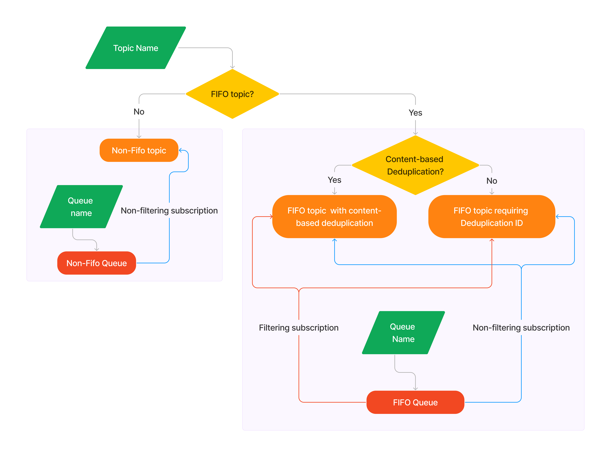

# ***Publish and subscribe to topics using filters and queues***

## Overview

Publish and subscribe is a mechanism for passing information. It’s used in social media, and it’s also used internally in software applications. A producer publishes a message, and the subscribers receive the message. In software, publish and subscribe notifications make message passing flexible and robust. The producers of messages are decoupled from the consumers of messages.

Use the sample code in this folder to explore publishing and subscribing to a topic by using filters and queues. This tutorial does not create a complete end-to-end application. Instead, you can use it to play around with a publish and subscribe architecture.

You can create an Amazon SNS topic and subscribe two Amazon SQS queues to the topic. You can enable FIFO (First-In-First-Out) queueing, and you can add filtered subscriptions. Then, you can publish messages to the topic and see the results in the queues.

You can publish and subscribe using Amazon SNS alone. But combining Amazon SNS with Amazon SQS gives you more flexibility in how the messages are consumed.

Amazon SNS is a push service. It pushes to endpoints such as email addresses, mobile application endpoints, or SQS queues. (For a full list of endpoints, see [SNS event destinations](https://docs.aws.amazon.com/sns/latest/dg/sns-event-destinations.html)).

With Amazon SQS, messages are received from a queue by polling. With polling, the subscriber receives messages by calling a receive message API. Any code can poll the queue. Also, the messages stay in the queue until you delete them. This gives you more flexibility in how the messages are processed.

The sample code builds a command line application that asks you for input.

The sample code implements the following steps:

1. Create an SNS topic.
2. Create two SQS queues.
3. Publish messages to the SNS topic.
4. Retrieve messages from the SQS queues.
5. Clean up resources

The following diagram shows the available options

## Implementations

This example is implemented in the following languages:

* [C++](../../../cpp/example_code/cross-service/topics_and_queues)
* [.NET](../../../dotnetv3/cross-service/TopicsAndQueues)
* [Go](../../../gov2/workflows/topics_and_queues)
* [JavaScript](../../../javascriptv3/example_code/cross-services/wkflw-topics-queues)
* [Java](../../../javav2/usecases/topics_and_queues)
* [Kotlin](../../../kotlin/usecases/topics_and_queues)

## Additional reading

* [Community.aws: Coding 'Publish and Subscribe' Using SNS, SQS, and the AWS SDKs](https://community.aws/content/2duRHzEUPyZbYm0oIeiyCzUhVJA/topics_and_queues_workflow_with_sdks)

---

Copyright Amazon.com, Inc. or its affiliates. All Rights Reserved.

SPDX-License-Identifier: Apache-2.0
