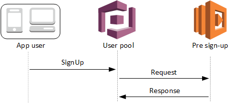
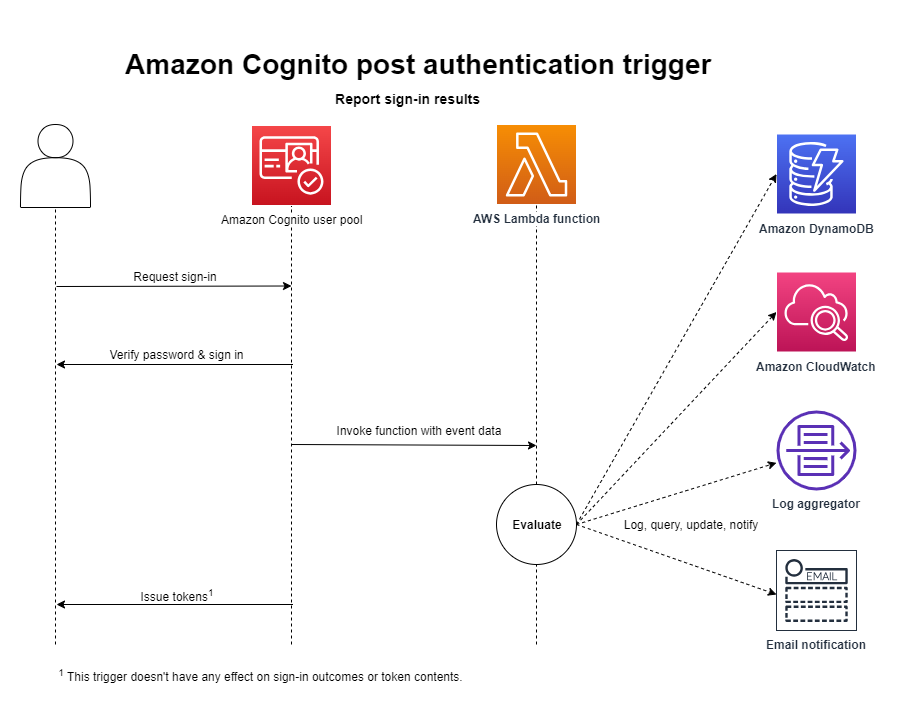

# Customize Amazon Cognito authentication behavior with Lambda functions

## Overview

This example shows how to use AWS SDKs to customize Amazon Cognito authentication behavior. You can configure
your Amazon Cognito user pool to automatically invoke AWS Lambda functions at various points in the authentication
process, such as before sign-up, during sign-in, and after authentication.

There are three scenarios demonstrated by this example:

* Automatically confirm and verify the email of known users by using a pre sign-up trigger.
* Automatically add known users at sign-in by using a migrate user trigger.
* Write custom information to an Amazon DynamoDB table after users are authenticated by using a post authentication trigger.

## Automatically confirm known users

A [pre sign-up Lambda trigger](https://docs.aws.amazon.com/cognito/latest/developerguide/user-pool-lambda-pre-sign-up.html) 
is invoked when a user starts the sign-up process and lets your Lambda function
take action before Amazon Cognito adds the user to the user pool.

 

This scenario demonstrates the following steps and tasks:

1. Configures the user pool to call a Lambda function for the `PreSignUp` trigger.
2. Prompts you to select a user from a list of known users and enter a password for the user.
3. Calls the `SignUp` action to sign-up with Amazon Cognito.
4. Before processing the new user the Lambda function is invoked: 
   1. The Lambda function scans the Amazon DynamoDB table of known users for the user's email. 
   2. If the known user record is found and the username matches the supplied username, 
     the user is auto-confirmed and email is auto-verified.
   3. If the known user record is found and the username does not match, the user is accepted
     but email verification is required.
   4. If the user is not found, no action is taken and sign-up continues without auto-confirmation. 
5. After sign-up completes, gets and displays the most recent CloudWatch Logs stream for the
  Lambda function to show you what the function logged during processing.
6. Signs in as the new user to confirm that sign-in works as expected.
7. Deletes resources.

## Automatically migrate known users

A [migrate user Lambda trigger](https://docs.aws.amazon.com/cognito/latest/developerguide/user-pool-lambda-migrate-user.html)
is invoked when a user doesn't exist in the user pool at sign-in with a password. 
After the Lambda function returns successfully, Amazon Cognito creates the user in the user pool. 

This scenario demonstrates the following steps and tasks:

1. Configures the user pool to call a Lambda function for the `MigrateUser` trigger.
2. Prompts you to enter a username and an email address that you own. This email is used during the
  example to receive a confirmation code from Amazon Cognito.
3. Add the username and email to the known users Amazon DynamoDB table. This is so the Lambda
  function can look up the user during migration handling.
4. Signs in to Amazon Cognito with the specified username and email.
5. The user doesn’t exist in the user pool so the Lambda function is invoked:
   1. The Lambda function scans the Amazon DynamoDB table for the username.
   2. If the username is found, the email is marked as verified and the user is marked as
     password reset required.
   3. If the username is not found, no action is taken and the user is rejected by Amazon Cognito.
6. After sign-in completes, gets and displays the most recent CloudWatch Logs stream for the
  Lambda function to show you what the function logged during processing.
7. Performs the forgot password flow to reset the password for the migrated user:
    1. Amazon Cognito sends an email with a confirmation code.
    2. The example prompts you to enter the confirmation code and a new password.
    3. Signs in as the new user to confirm that sign-in works as expected.
8. Deletes resources.
    
## Write custom activity after authentication

A [post authentication Lambda trigger](https://docs.aws.amazon.com/cognito/latest/developerguide/user-pool-lambda-post-authentication.html)
is invoked after signing in a user, so you can add custom logic after Amazon Cognito authenticates the user.

This scenario demonstrates the following steps and tasks:

1. Selects a user from the known users table and uses administrator functions to add the
  user to the user pool with a password you supply.
2. Configures the user pool to call a Lambda function for the `PostAuthentication` trigger.
3. Signs in the new user.
4. After the user is authenticated, the Lambda function is invoked:
   1. The Lambda function writes custom information to CloudWatch Logs.
   2. The function also adds information to the record in the known users Amazon DynamoDB table. 
5. After authentication completes, gets and displays the most recent CloudWatch Logs stream for the
  Lambda function to show you what the function logged during processing.
6. Gets the user data from the Amazon DynamoDB table to show what has been written to this external system.
7. Deletes resources.

## Implementations

This example is implemented in the following languages:

- [Go](../../../gov2/workflows/user_pools_and_lambda_triggers/README.md)
- [JavaScript](../../../javascriptv3/example_code/cross-services/wkflw-pools-triggers/README.md)

## Additional reading

- [Amazon Cognito user pools](https://docs.aws.amazon.com/cognito/latest/developerguide/cognito-user-identity-pools.html)

---

Copyright Amazon.com, Inc. or its affiliates. All Rights Reserved. SPDX-License-Identifier: Apache-2.0
