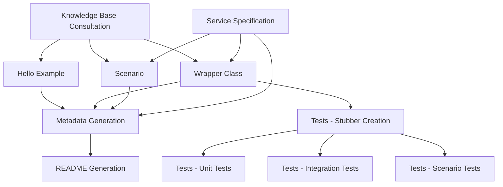

# .NET Code Generation Orchestration

## Purpose
Coordinate the modular components to generate complete AWS SDK code examples. Each component can be used independently or in sequence.

## Component Dependencies



## Execution Workflows

### Full Service Implementation
Complete implementation of a new AWS service:

```bash
# 1. Knowledge Base Consultation (MANDATORY FIRST)
# Use ListKnowledgeBases + QueryKnowledgeBases for standards and patterns

# 2. Generate Core Components
# - Hello example: Hello{Service}.cs
# - Wrapper class: {Service}Wrapper.cs  
# - Scenario: {Service}Basics.cs
# - Project files: *.csproj files

# 3. Generate Test Suite
# - Unit tests: {Service}Tests.cs
# - Integration tests: {Service}IntegrationTests.cs

# 4. Generate Metadata
# - Read service specification for exact metadata keys
# - Create .doc_gen/metadata/{service}_metadata.yaml

# 5. Generate Documentation
# - Run writeme tool to create/update README.md

# 6. Build and Validate
# - Build solution with dotnet build
# - Run tests with dotnet test
```

### Individual Component Updates

#### Update Hello Example Only
```bash
# Focus: hello.md guidance
# Files: {service}_hello.py
# Validation: Run hello example, check output
```

#### Update Wrapper Class Only  
```bash
# Focus: wrapper.md guidance
# Files: {service}_wrapper.py
# Validation: Run unit tests for wrapper methods
```

#### Update Scenario Only
```bash
# Focus: scenario.md guidance  
# Files: scenario_{service}_basics.py
# Validation: Run scenario tests, check user interaction
```

#### Update Tests Only
```bash
# Focus: tests.md guidance
# Files: All test files in test/ directory
# Validation: Run pytest with all markers
```

#### Update Metadata Only
```bash
# Focus: metadata.md guidance
# Files: .doc_gen/metadata/{service}_metadata.yaml
# Validation: Run writeme tool validation
```

#### Update Documentation Only
```bash
# Focus: readme.md guidance
# Files: README.md (generated)
# Validation: Check README completeness and accuracy
```

## Quality Gates

### Component-Level Validation
Each component has specific validation requirements:

#### Hello Example Validation
```bash
dotnet run --project dotnetv4/{Service}/Actions/Hello{Service}.csproj
```

#### Wrapper Class Validation
```bash
dotnet build dotnetv4/{Service}/Actions/{Service}Wrapper.csproj
```

#### Scenario Validation
```bash
dotnet run --project dotnetv4/{Service}/Scenarios/{Service}_Basics/{Service}Basics.csproj
```

#### Test Validation
```bash
dotnet test dotnetv4/{Service}/Tests/{Service}Tests.csproj
dotnet test dotnetv4/{Service}/Tests/{Service}Tests.csproj --filter Category=Integration
```

#### Code Quality Validation
```bash
dotnet format dotnetv4/{Service}/
```

#### Documentation Validation
```bash
cd .tools/readmes
source .venv/bin/activate
python -m writeme --languages .NET:4 --services {service}
```

### Integration Validation
Full integration testing across all components:

```bash
# 1. All unit tests pass
dotnet test dotnetv4/{Service}/Tests/{Service}Tests.csproj --filter "Category!=Integration"

# 2. All integration tests pass
dotnet test dotnetv4/{Service}/Tests/{Service}Tests.csproj --filter Category=Integration

# 3. All examples execute successfully
dotnet run --project dotnetv4/{Service}/Actions/Hello{Service}.csproj
dotnet run --project dotnetv4/{Service}/Scenarios/{Service}_Basics/{Service}Basics.csproj

# 4. Code quality passes
dotnet format dotnetv4/{Service}/

# 5. Documentation generates successfully
cd .tools/readmes && source .venv/bin/activate && python -m writeme --languages .NET:4 --services {service}
```

## Component Selection Guide

### When to Use Individual Components

#### Hello Example Only
- Quick service introduction needed
- Testing basic service connectivity
- Creating minimal working example

#### Wrapper Class Only
- Need reusable service operations
- Building foundation for other examples
- Focusing on error handling patterns

#### Scenario Only
- Demonstrating complete workflows
- Educational/tutorial content
- Interactive user experiences

#### Tests Only
- Improving test coverage
- Adding new test cases
- Fixing test infrastructure

#### Metadata Only
- Documentation pipeline integration
- Updating snippet references
- Fixing metadata validation errors

#### Documentation Only
- README updates needed
- Documentation refresh
- Link validation and updates

### When to Use Full Workflow
- New service implementation
- Complete service overhaul
- Major structural changes
- Initial service setup

## Error Recovery

### Component Failure Handling
If any component fails, you can:

1. **Fix and retry** the specific component
2. **Skip and continue** with other components
3. **Rollback changes** and restart from known good state

### Common Recovery Scenarios

#### Test Failures
```bash
# Fix test issues and re-run
python -m pytest python/example_code/{service}/test/ -v --tb=short
```

#### Metadata Validation Failures
```bash
# Check metadata syntax
python -c "import yaml; yaml.safe_load(open('.doc_gen/metadata/{service}_metadata.yaml'))"

# Validate against specification
# Compare with scenarios/basics/{service}/SPECIFICATION.md
```

#### Documentation Generation Failures
```bash
# Check for missing dependencies
cd .tools/readmes && source .venv/bin/activate && pip list

# Validate metadata first
python -m writeme --languages Python:3 --services {service} --verbose
```

This modular approach allows for targeted updates, easier debugging, and more maintainable code generation processes.