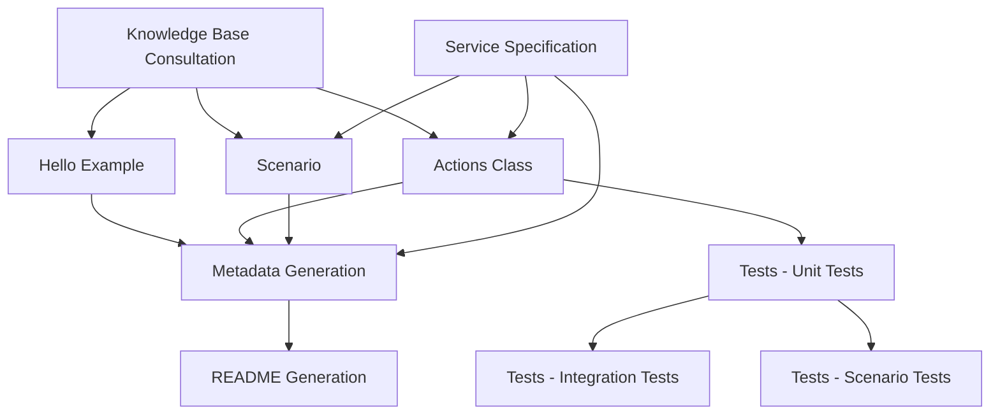

# Java Code Generation Orchestration

## Purpose
Coordinate the modular components to generate complete AWS SDK for Java V2 code examples. Each component can be used independently or in sequence.

## Component Dependencies



## Execution Workflows

### Full Service Implementation
Complete implementation of a new AWS service:

```bash
# 1. Knowledge Base Consultation (MANDATORY FIRST)
# Use ListKnowledgeBases + QueryKnowledgeBases for standards and patterns

# 2. Generate Core Components
# - Hello example: Hello{Service}.java
# - Actions class: {Service}Actions.java  
# - Scenario: {Service}Scenario.java
# - Build configuration: pom.xml updates

# 3. Generate Test Suite
# - Unit tests: {Service}ActionsTest.java
# - Integration tests: {Service}IntegrationTest.java
# - Scenario tests: {Service}ScenarioTest.java

# 4. Generate Metadata
# - Read service specification for exact metadata keys
# - Create .doc_gen/metadata/{service}_metadata.yaml

# 5. Generate Documentation
# - Run writeme tool to create/update README.md
```

### Individual Component Updates

#### Update Hello Example Only
```bash
# Focus: hello.md guidance
# Files: Hello{Service}.java
# Validation: Compile and run hello example
```

#### Update Actions Class Only  
```bash
# Focus: actions.md guidance
# Files: {Service}Actions.java
# Validation: Run unit tests for actions methods
```

#### Update Scenario Only
```bash
# Focus: scenario.md guidance  
# Files: {Service}Scenario.java
# Validation: Run scenario tests, check user interaction
```

#### Update Tests Only
```bash
# Focus: tests.md guidance
# Files: All test files in test/ directory
# Validation: Run mvn test with all test categories
```

#### Update Metadata Only
```bash
# Focus: metadata.md guidance
# Files: .doc_gen/metadata/{service}_metadata.yaml
# Validation: Run writeme tool validation
```

#### Update Documentation Only
```bash
# Focus: readme.md guidance
# Files: README.md (generated)
# Validation: Check README completeness and accuracy
```

## Quality Gates

### Component-Level Validation
Each component has specific validation requirements:

#### Hello Example Validation
```bash
cd javav2/example_code/{service}
mvn compile exec:java -Dexec.mainClass="com.example.{service}.Hello{Service}" -Dexec.args="us-east-1"
```

#### Actions Class Validation
```bash
cd javav2/example_code/{service}
mvn compile
# Verify compilation succeeds and no syntax errors
```

#### Scenario Validation
```bash
cd javav2/example_code/{service}
mvn compile exec:java -Dexec.mainClass="com.example.{service}.{Service}Scenario" -Dexec.args="us-east-1"
```

#### Test Validation
```bash
cd javav2/example_code/{service}
mvn test -Dtest="{Service}ActionsTest"
mvn test -Dtest="{Service}IntegrationTest" -Dgroups="integration"
```

#### Code Quality Validation
```bash
cd javav2/example_code/{service}
mvn checkstyle:check
mvn spotbugs:check
```

#### Documentation Validation
```bash
cd .tools/readmes
source .venv/bin/activate
python -m writeme --languages Java:2 --services {service}
```

### Integration Validation
Full integration testing across all components:

```bash
# 1. All unit tests pass
cd javav2/example_code/{service}
mvn test -Dtest="*Test" -Dgroups="!integration"

# 2. All integration tests pass
mvn test -Dtest="*IntegrationTest" -Dgroups="integration"

# 3. All examples execute successfully
mvn compile exec:java -Dexec.mainClass="com.example.{service}.Hello{Service}" -Dexec.args="us-east-1"
mvn compile exec:java -Dexec.mainClass="com.example.{service}.{Service}Scenario" -Dexec.args="us-east-1"

# 4. Code quality passes
mvn checkstyle:check spotbugs:check

# 5. Documentation generates successfully
cd .tools/readmes && source .venv/bin/activate && python -m writeme --languages Java:2 --services {service}
```

## Component Selection Guide

### When to Use Individual Components

#### Hello Example Only
- Quick service introduction needed
- Testing basic service connectivity
- Creating minimal working example

#### Actions Class Only
- Need reusable service operations
- Building foundation for other examples
- Focusing on error handling patterns

#### Scenario Only
- Demonstrating complete workflows
- Educational/tutorial content
- Interactive user experiences

#### Tests Only
- Improving test coverage
- Adding new test cases
- Fixing test infrastructure

#### Metadata Only
- Documentation pipeline integration
- Updating snippet references
- Fixing metadata validation errors

#### Documentation Only
- README updates needed
- Documentation refresh
- Link validation and updates

### When to Use Full Workflow
- New service implementation
- Complete service overhaul
- Major structural changes
- Initial service setup

## Error Recovery

### Component Failure Handling
If any component fails, you can:

1. **Fix and retry** the specific component
2. **Skip and continue** with other components
3. **Rollback changes** and restart from known good state

### Common Recovery Scenarios

#### Compilation Failures
```bash
# Fix compilation issues and re-run
cd javav2/example_code/{service}
mvn clean compile
```

#### Test Failures
```bash
# Fix test issues and re-run
mvn test -Dtest="FailingTest" -Dgroups="unit"
```

#### Metadata Validation Failures
```bash
# Check metadata syntax
python -c "import yaml; yaml.safe_load(open('.doc_gen/metadata/{service}_metadata.yaml'))"

# Validate against specification
# Compare with scenarios/basics/{service}/SPECIFICATION.md
```

#### Documentation Generation Failures
```bash
# Check for missing dependencies
cd .tools/readmes && source .venv/bin/activate && pip list

# Validate metadata first
python -m writeme --languages Java:2 --services {service} --verbose
```

## Build System Integration

### Maven Configuration
Ensure proper Maven configuration in `pom.xml`:

```xml
<dependencies>
    <dependency>
        <groupId>software.amazon.awssdk</groupId>
        <artifactId>{service}</artifactId>
        <version>${aws.java.sdk.version}</version>
    </dependency>
    <dependency>
        <groupId>org.junit.jupiter</groupId>
        <artifactId>junit-jupiter</artifactId>
        <version>${junit.version}</version>
        <scope>test</scope>
    </dependency>
</dependencies>

<build>
    <plugins>
        <plugin>
            <groupId>org.apache.maven.plugins</groupId>
            <artifactId>maven-compiler-plugin</artifactId>
            <version>3.11.0</version>
            <configuration>
                <source>17</source>
                <target>17</target>
            </configuration>
        </plugin>
        <plugin>
            <groupId>org.apache.maven.plugins</groupId>
            <artifactId>maven-surefire-plugin</artifactId>
            <version>3.1.2</version>
            <configuration>
                <groups>!integration</groups>
            </configuration>
        </plugin>
    </plugins>
</build>
```

### Test Execution Profiles
```xml
<profiles>
    <profile>
        <id>integration</id>
        <build>
            <plugins>
                <plugin>
                    <groupId>org.apache.maven.plugins</groupId>
                    <artifactId>maven-surefire-plugin</artifactId>
                    <configuration>
                        <groups>integration</groups>
                    </configuration>
                </plugin>
            </plugins>
        </build>
    </profile>
</profiles>
```

## CI/CD Integration

### Automated Validation Pipeline
```bash
# In CI/CD pipeline, validate all components
cd javav2/example_code/{service}

# 1. Compile all code
mvn clean compile

# 2. Run unit tests
mvn test -Dgroups="!integration"

# 3. Run integration tests (if credentials available)
mvn test -Dgroups="integration"

# 4. Check code quality
mvn checkstyle:check spotbugs:check

# 5. Validate documentation
cd .tools/readmes
source .venv/bin/activate
python -m writeme --languages Java:2 --services {service} --check
```

This modular approach allows for targeted updates, easier debugging, and more maintainable code generation processes while maintaining Java-specific build and testing requirements.