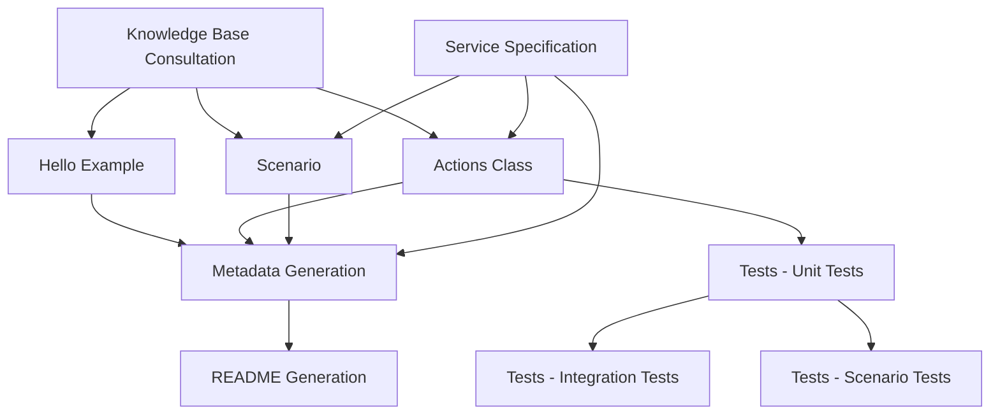

# Kotlin Code Generation Orchestration

## Purpose
Coordinate the modular components to generate complete AWS SDK for Kotlin code examples. Each component can be used independently or in sequence.

## Component Dependencies



## Execution Workflows

### Full Service Implementation
Complete implementation of a new AWS service:

```bash
# 1. Knowledge Base Consultation (MANDATORY FIRST)
# Use ListKnowledgeBases + QueryKnowledgeBases for standards and patterns

# 2. Generate Core Components
# - Hello example: Hello{Service}.kt
# - Actions class: {Service}Actions.kt  
# - Scenario: {Service}Basics.kt or {Service}Scenario.kt
# - Build configuration: build.gradle.kts updates

# 3. Generate Test Suite
# - Unit tests: {Service}ActionsTest.kt
# - Integration tests: {Service}IntegrationTest.kt
# - Scenario tests: {Service}ScenarioTest.kt

# 4. Generate Metadata
# - Read service specification for exact metadata keys
# - Create .doc_gen/metadata/{service}_metadata.yaml

# 5. Generate Documentation
# - Run writeme tool to create/update README.md
```

### Individual Component Updates

#### Update Hello Example Only
```bash
# Focus: hello.md guidance
# Files: Hello{Service}.kt
# Validation: Compile and run hello example
```

#### Update Actions Class Only  
```bash
# Focus: actions.md guidance
# Files: {Service}Actions.kt
# Validation: Run unit tests for actions methods
```

#### Update Scenario Only
```bash
# Focus: basics.md guidance  
# Files: {Service}Basics.kt or {Service}Scenario.kt
# Validation: Run scenario tests, check user interaction
```

#### Update Tests Only
```bash
# Focus: tests.md guidance
# Files: All test files in test/ directory
# Validation: Run ./gradlew test with all test categories
```

#### Update Metadata Only
```bash
# Focus: metadata.md guidance
# Files: .doc_gen/metadata/{service}_metadata.yaml
# Validation: Run writeme tool validation
```

#### Update Documentation Only
```bash
# Focus: readme.md guidance
# Files: README.md (generated)
# Validation: Check README completeness and accuracy
```

## Quality Gates

### Component-Level Validation
Each component has specific validation requirements:

#### Hello Example Validation
```bash
cd kotlin/services/{service}
./gradlew run --args="us-east-1"
```

#### Actions Class Validation
```bash
cd kotlin/services/{service}
./gradlew compileKotlin
# Verify compilation succeeds and no syntax errors
```

#### Scenario Validation
```bash
cd kotlin/services/{service}
./gradlew run --args="us-east-1"
```

#### Test Validation
```bash
cd kotlin/services/{service}
./gradlew test --tests "*ActionsTest"
./gradlew test --tests "*IntegrationTest"
```

#### Code Quality Validation
```bash
cd kotlin/services/{service}
./gradlew ktlintCheck
./gradlew detekt
```

#### Documentation Validation
```bash
cd .tools/readmes
source .venv/bin/activate
python -m writeme --languages Kotlin:1 --services {service}
```

### Integration Validation
Full integration testing across all components:

```bash
# 1. All unit tests pass
cd kotlin/services/{service}
./gradlew test --exclude-task integrationTest

# 2. All integration tests pass
./gradlew integrationTest

# 3. All examples execute successfully
./gradlew run --args="us-east-1"

# 4. Code quality passes
./gradlew ktlintCheck detekt

# 5. Documentation generates successfully
cd .tools/readmes && source .venv/bin/activate && python -m writeme --languages Kotlin:1 --services {service}
```

## Component Selection Guide

### When to Use Individual Components

#### Hello Example Only
- Quick service introduction needed
- Testing basic service connectivity
- Creating minimal working example

#### Actions Class Only
- Need reusable service operations
- Building foundation for other examples
- Focusing on error handling patterns

#### Scenario Only
- Demonstrating complete workflows
- Educational/tutorial content
- Interactive user experiences

#### Tests Only
- Improving test coverage
- Adding new test cases
- Fixing test infrastructure

#### Metadata Only
- Documentation pipeline integration
- Updating snippet references
- Fixing metadata validation errors

#### Documentation Only
- README updates needed
- Documentation refresh
- Link validation and updates

### When to Use Full Workflow
- New service implementation
- Complete service overhaul
- Major structural changes
- Initial service setup

## Error Recovery

### Component Failure Handling
If any component fails, you can:

1. **Fix and retry** the specific component
2. **Skip and continue** with other components
3. **Rollback changes** and restart from known good state

### Common Recovery Scenarios

#### Compilation Failures
```bash
# Fix compilation issues and re-run
cd kotlin/services/{service}
./gradlew clean compileKotlin
```

#### Test Failures
```bash
# Fix test issues and re-run
./gradlew test --tests "FailingTest" --info
```

#### Metadata Validation Failures
```bash
# Check metadata syntax
python -c "import yaml; yaml.safe_load(open('.doc_gen/metadata/{service}_metadata.yaml'))"

# Validate against specification
# Compare with scenarios/basics/{service}/SPECIFICATION.md
```

#### Documentation Generation Failures
```bash
# Check for missing dependencies
cd .tools/readmes && source .venv/bin/activate && pip list

# Validate metadata first
python -m writeme --languages Kotlin:1 --services {service} --verbose
```

## Build System Integration

### Gradle Configuration
Ensure proper Gradle configuration in `build.gradle.kts`:

```kotlin
plugins {
    kotlin("jvm") version "1.9.10"
    application
    id("org.jlleitschuh.gradle.ktlint") version "11.6.1"
    id("io.gitlab.arturbosch.detekt") version "1.23.1"
}

dependencies {
    implementation("aws.sdk.kotlin:{service}:1.0.0")
    implementation("org.jetbrains.kotlinx:kotlinx-coroutines-core:1.7.3")
    
    testImplementation("org.jetbrains.kotlin:kotlin-test-junit5")
    testImplementation("org.junit.jupiter:junit-jupiter-engine:5.10.0")
    testImplementation("io.mockk:mockk:1.13.8")
    testImplementation("org.jetbrains.kotlinx:kotlinx-coroutines-test:1.7.3")
}

application {
    mainClass.set("com.kotlin.{service}.Hello{Service}Kt")
}

tasks.test {
    useJUnitPlatform()
    exclude("**/*IntegrationTest*")
}

tasks.register<Test>("integrationTest") {
    useJUnitPlatform()
    include("**/*IntegrationTest*")
    group = "verification"
    description = "Runs integration tests"
}

ktlint {
    version.set("0.50.0")
}

detekt {
    config.setFrom("$projectDir/detekt.yml")
    buildUponDefaultConfig = true
}
```

### Test Execution Tasks
```kotlin
tasks.register<Test>("unitTest") {
    useJUnitPlatform()
    exclude("**/*IntegrationTest*")
    group = "verification"
    description = "Runs unit tests"
}

tasks.register<Test>("integrationTest") {
    useJUnitPlatform()
    include("**/*IntegrationTest*")
    group = "verification"
    description = "Runs integration tests"
}
```

## CI/CD Integration

### Automated Validation Pipeline
```bash
# In CI/CD pipeline, validate all components
cd kotlin/services/{service}

# 1. Compile all code
./gradlew compileKotlin compileTestKotlin

# 2. Run unit tests
./gradlew unitTest

# 3. Run integration tests (if credentials available)
./gradlew integrationTest

# 4. Check code quality
./gradlew ktlintCheck detekt

# 5. Validate documentation
cd .tools/readmes
source .venv/bin/activate
python -m writeme --languages Kotlin:1 --services {service} --check
```

## Kotlin-Specific Considerations

### Coroutines and Suspend Functions
Kotlin examples use coroutines for async operations:
```kotlin
suspend fun main() {
    // Async operations
}

suspend fun performAction(): Response {
    // Suspend function implementation
}
```

### Null Safety
Leverage Kotlin's null safety features:
```kotlin
val response: Response? = client.operation()
response?.let { 
    // Handle non-null response
}
```

### Extension Functions
Use extension functions for utility operations:
```kotlin
fun List<Resource>.filterByStatus(status: Status): List<Resource> {
    return this.filter { it.status == status }
}
```

### Data Classes
Use data classes for structured data:
```kotlin
data class ResourceInfo(
    val id: String,
    val name: String,
    val status: Status
)
```

## Build Tool Integration

### Gradle Wrapper
Always use Gradle wrapper for consistency:
```bash
./gradlew build
./gradlew test
./gradlew run
```

### Multi-Module Projects
For complex services, consider multi-module structure:
```
kotlin/services/{service}/
├── build.gradle.kts
├── actions/
│   ├── build.gradle.kts
│   └── src/main/kotlin/
├── scenarios/
│   ├── build.gradle.kts
│   └── src/main/kotlin/
└── examples/
    ├── build.gradle.kts
    └── src/main/kotlin/
```

This modular approach allows for targeted updates, easier debugging, and more maintainable code generation processes while maintaining Kotlin-specific build and testing requirements.