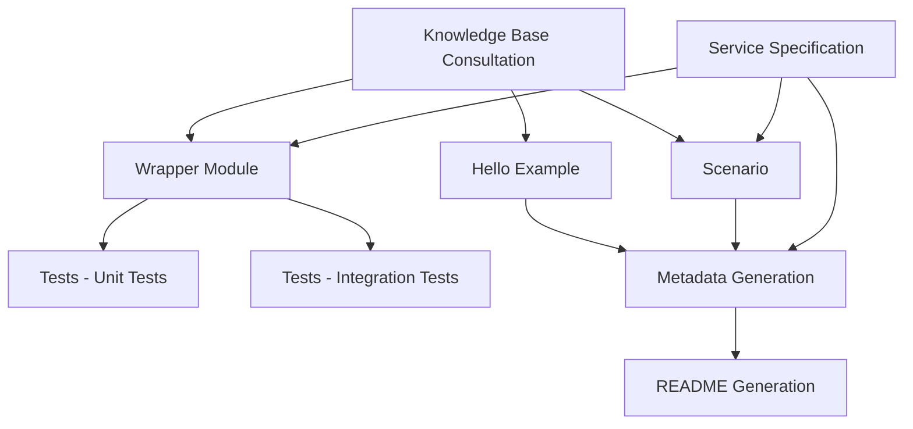

# Rust Code Generation Orchestration

## Purpose
Coordinate the modular components to generate complete AWS SDK code examples. Each component can be used independently or in sequence.

## Component Dependencies



## Execution Workflows

### Full Service Implementation
Complete implementation of a new AWS service:

```bash
# 1. Knowledge Base Consultation (MANDATORY FIRST)
# Use ListKnowledgeBases + QueryKnowledgeBases for standards and patterns

# 2. Generate Core Components
# - Hello example: src/bin/hello.rs
# - Wrapper module: src/{service}.rs (if mocking needed)
# - Scenario: src/bin/{scenario-name}.rs and src/{scenario_name}/scenario.rs
# - Cargo.toml: Package configuration

# 3. Generate Test Suite
# - Unit tests: #[cfg(test)] mod tests in source files
# - Integration tests: src/{scenario_name}/tests/mod.rs

# 4. Generate Metadata
# - Read service specification for exact metadata keys
# - Create .doc_gen/metadata/{service}_metadata.yaml

# 5. Generate Documentation
# - Run writeme tool to create/update README.md

# 6. Build and Validate
# - Build with cargo build
# - Run tests with cargo test
# - Check formatting with cargo fmt --check
# - Run linter with cargo clippy
```

### Individual Component Updates

#### Update Hello Example Only
```bash
# Focus: hello.md guidance
# Files: src/bin/hello.rs
# Validation: cargo run --bin hello
```

#### Update Wrapper Module Only  
```bash
# Focus: wrapper.md guidance
# Files: src/{service}.rs
# Validation: cargo test --lib
```

#### Update Scenario Only
```bash
# Focus: basics.md guidance  
# Files: src/bin/{scenario-name}.rs, src/{scenario_name}/scenario.rs
# Validation: cargo run --bin {scenario-name}
```

#### Update Tests Only
```bash
# Focus: tests.md guidance
# Files: Unit tests in source files, integration tests in tests/ folders
# Validation: cargo test
```

#### Update Metadata Only
```bash
# Focus: metadata.md guidance
# Files: .doc_gen/metadata/{service}_metadata.yaml
# Validation: Run writeme tool validation
```

#### Update Documentation Only
```bash
# Focus: README generation
# Files: README.md (generated)
# Validation: Check README completeness and accuracy
```

## Quality Gates

### Component-Level Validation
Each component has specific validation requirements:

#### Hello Example Validation
```bash
# Build hello example
cargo build --bin hello

# Run hello example
cargo run --bin hello

# Check for compilation errors
cargo check --bin hello
```

#### Wrapper Module Validation
```bash
# Build library
cargo build --lib

# Run unit tests
cargo test --lib

# Check for warnings
cargo clippy --lib
```

#### Scenario Validation
```bash
# Build scenario
cargo build --bin {scenario-name}

# Run scenario (may require AWS credentials)
cargo run --bin {scenario-name}

# Check for compilation errors
cargo check --bin {scenario-name}
```

#### Test Validation
```bash
# Run all tests
cargo test

# Run tests with output
cargo test -- --nocapture

# Run specific test module
cargo test --lib {module_name}

# Run integration tests
cargo test --test '*'
```

#### Code Quality Validation
```bash
# Format code
cargo fmt

# Check formatting
cargo fmt --check

# Run linter
cargo clippy -- -D warnings

# Check for errors
cargo check
```

#### Documentation Validation
```bash
cd .tools/readmes
source .venv/bin/activate
python -m writeme --languages Rust:1 --services {service}
```

### Integration Validation
Full integration testing across all components:

```bash
# 1. All tests pass
cargo test

# 2. All examples compile
cargo build --bins

# 3. Code quality passes
cargo fmt --check
cargo clippy -- -D warnings

# 4. Examples execute successfully (with credentials)
cargo run --bin hello
cargo run --bin {scenario-name}

# 5. Documentation generates successfully
cd .tools/readmes && source .venv/bin/activate && python -m writeme --languages Rust:1 --services {service}
```

## Component Selection Guide

### When to Use Individual Components

#### Hello Example Only
- Quick service introduction needed
- Testing basic service connectivity
- Creating minimal working example

#### Wrapper Module Only
- Need mockable service operations for testing
- Building foundation for testable scenarios
- Focusing on error handling patterns

#### Scenario Only
- Demonstrating complete workflows
- Educational/tutorial content
- Interactive user experiences

#### Tests Only
- Improving test coverage
- Adding new test cases
- Fixing test infrastructure

#### Metadata Only
- Documentation pipeline integration
- Updating snippet references
- Fixing metadata validation errors

#### Documentation Only
- README updates needed
- Documentation refresh
- Link validation and updates

### When to Use Full Workflow
- New service implementation
- Complete service overhaul
- Major structural changes
- Initial service setup

## Error Recovery

### Component Failure Handling
If any component fails, you can:

1. **Fix and retry** the specific component
2. **Skip and continue** with other components
3. **Rollback changes** and restart from known good state

### Common Recovery Scenarios

#### Compilation Failures
```bash
# Check for errors
cargo check

# Get detailed error information
cargo build --verbose

# Fix errors and rebuild
cargo build
```

#### Test Failures
```bash
# Run tests with output to see failures
cargo test -- --nocapture

# Run specific failing test
cargo test test_name -- --nocapture

# Fix and re-run
cargo test
```

#### Metadata Validation Failures
```bash
# Check metadata syntax
python -c "import yaml; yaml.safe_load(open('.doc_gen/metadata/{service}_metadata.yaml'))"

# Validate against specification
# Compare with scenarios/basics/{service}/SPECIFICATION.md
```

#### Documentation Generation Failures
```bash
# Check for missing dependencies
cd .tools/readmes && source .venv/bin/activate && pip list

# Validate metadata first
python -m writeme --languages Rust:1 --services {service} --verbose
```

## Build System Integration

### Cargo Workspace
Rust examples are typically organized in a Cargo workspace:

```toml
# rustv1/Cargo.toml
[workspace]
members = [
    "examples/s3",
    "examples/dynamodb",
    "examples/{service}",
]
```

### Building All Examples
```bash
# From rustv1 directory
cargo build --workspace

# Run all tests
cargo test --workspace

# Format all code
cargo fmt --all

# Lint all code
cargo clippy --workspace -- -D warnings
```

## Continuous Integration

### CI Pipeline Steps
```bash
# 1. Check formatting
cargo fmt --all --check

# 2. Run linter
cargo clippy --workspace -- -D warnings

# 3. Build all examples
cargo build --workspace

# 4. Run all tests
cargo test --workspace

# 5. Validate metadata
cd .tools/readmes
source .venv/bin/activate
python -m writeme --languages Rust:1 --services {service}

# 6. Check for uncommitted changes
git diff --exit-code
```

## Development Workflow

### Typical Development Cycle
1. **Read specification** for requirements
2. **Consult knowledge bases** for patterns
3. **Create hello example** for basic connectivity
4. **Implement wrapper** if mocking needed
5. **Build scenario** following specification
6. **Write tests** for coverage
7. **Add metadata** for documentation
8. **Generate README** with writeme
9. **Validate everything** with quality gates
10. **Commit changes** after validation

### Iterative Development
- Start with hello example to verify connectivity
- Add wrapper if testing requires mocking
- Implement scenario incrementally by phase
- Write tests as you go
- Update metadata and docs at the end

## Best Practices
- ✅ **Always consult knowledge bases first**
- ✅ **Follow specification exactly** for scenarios
- ✅ **Test as you develop** don't wait until the end
- ✅ **Use cargo check frequently** for quick feedback
- ✅ **Run cargo clippy** to catch common issues
- ✅ **Format code regularly** with cargo fmt
- ✅ **Validate metadata early** to catch issues
- ✅ **Generate docs frequently** to verify completeness
- ✅ **Commit working increments** not just final code
- ✅ **Document as you go** don't defer documentation

## Common Pitfalls to Avoid
- ❌ **Skipping knowledge base consultation**
- ❌ **Not following specification exactly**
- ❌ **Creating wrappers when not needed**
- ❌ **Forgetting to add snippet tags**
- ❌ **Not testing error paths**
- ❌ **Ignoring compiler warnings**
- ❌ **Deferring metadata until the end**
- ❌ **Not validating generated documentation**
- ❌ **Committing unformatted code**
- ❌ **Skipping integration validation**

This modular approach allows for targeted updates, easier debugging, and more maintainable code generation processes.
